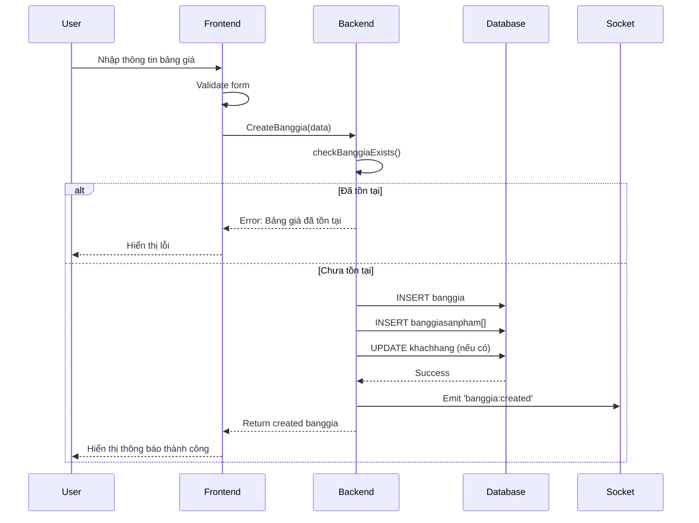
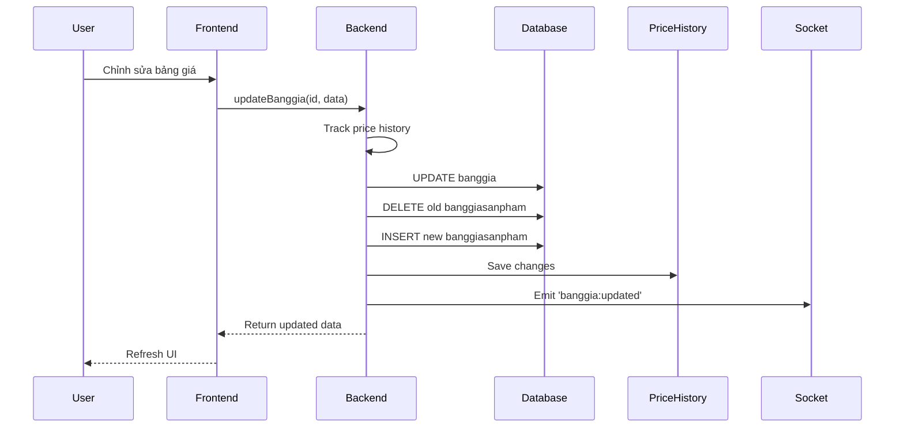
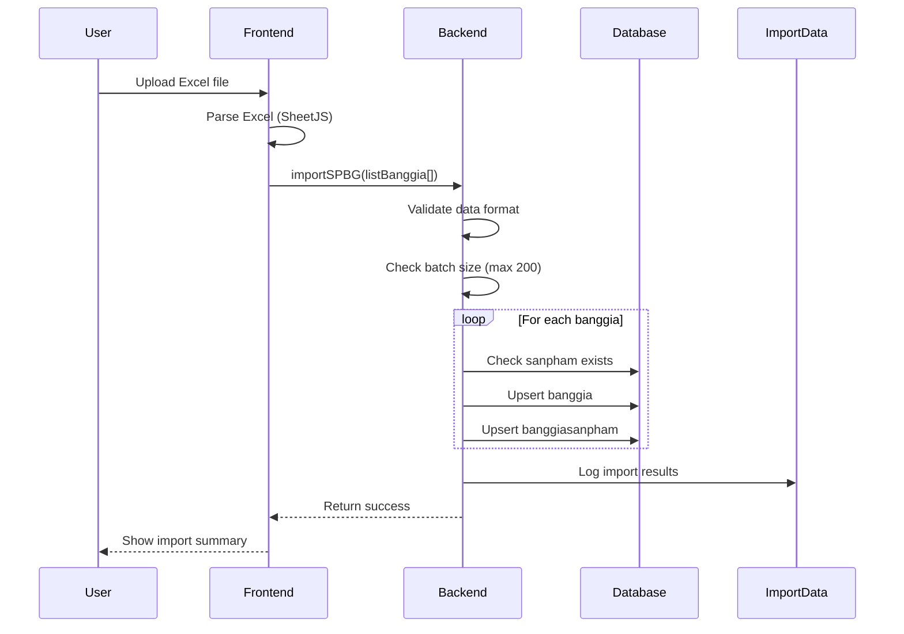
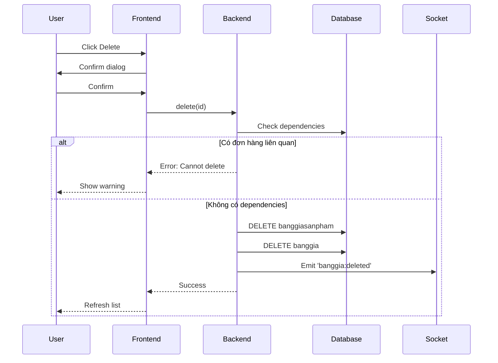

# 📊 Tài Liệu Chi Tiết - Tính Năng Bảng Giá (Price List)

## 📑 Mục Lục
- [1. Tổng Quan Hệ Thống](#1-tổng-quan-hệ-thống)
- [2. Kiến Trúc Database](#2-kiến-trúc-database)
- [3. Luồng Hoạt Động](#3-luồng-hoạt-động)
- [4. API Endpoints](#4-api-endpoints)
- [5. Frontend Components](#5-frontend-components)
- [6. Tính Năng Nâng Cao](#6-tính-năng-nâng-cao)
- [7. Hướng Dẫn Sử Dụng](#7-hướng-dẫn-sử-dụng)
- [8. Troubleshooting](#8-troubleshooting)

---

## 1. Tổng Quan Hệ Thống

### 🎯 Mục Đích
Hệ thống Bảng Giá quản lý giá bán sản phẩm theo:
- **Thời gian**: Bảng giá có hiệu lực từ ngày - đến ngày
- **Khách hàng**: Mỗi khách hàng có thể có bảng giá riêng
- **Sản phẩm**: Mỗi sản phẩm có giá khác nhau trong các bảng giá
- **Trạng thái**: Báo giá, Đang áp dụng, Hết hạn

### 🏗️ Kiến Trúc Tổng Thể
```
┌─────────────────────────────────────────────────┐
│           FRONTEND (Angular 14+)                │
│  ┌──────────────────────────────────────┐      │
│  │  Banggia Component (List & Detail)   │      │
│  │  - Table view với filters             │      │
│  │  - Detail form với tabs               │      │
│  │  - Import Excel                        │      │
│  └──────────────────────────────────────┘      │
│              ↓ GraphQL Service                  │
└─────────────────────────────────────────────────┘
                     ↓
┌─────────────────────────────────────────────────┐
│           BACKEND (NestJS)                      │
│  ┌──────────────────────────────────────┐      │
│  │  Banggia Service                      │      │
│  │  - CRUD Operations                    │      │
│  │  - Import/Export                      │      │
│  │  - Price History Tracking             │      │
│  │  - Validation                         │      │
│  └──────────────────────────────────────┘      │
│              ↓ Prisma ORM                       │
└─────────────────────────────────────────────────┘
                     ↓
┌─────────────────────────────────────────────────┐
│           DATABASE (PostgreSQL)                 │
│  - banggia (Price lists)                       │
│  - banggiasanpham (Product prices)             │
│  - khachhang (Customers)                       │
│  - sanpham (Products)                          │
└─────────────────────────────────────────────────┘
```

---

## 2. Kiến Trúc Database

### 📊 Schema Diagram
```sql
┌─────────────────────────────────────────────────┐
│              Banggia (Bảng Giá)                 │
├─────────────────────────────────────────────────┤
│ id          : UUID (PK)                         │
│ title       : String                            │
│ mabanggia   : String (Unique với time range)    │
│ type        : String (bansi/banle/khohang)      │
│ batdau      : DateTime (Start date)             │
│ ketthuc     : DateTime (End date)               │
│ status      : String (baogia/sudung/hethan)     │
│ isActive    : Boolean                           │
│ isDefault   : Boolean                           │
│ order       : Int                               │
│ ghichu      : String                            │
│ createdAt   : DateTime                          │
│ updatedAt   : DateTime                          │
└─────────────────────────────────────────────────┘
         │
         │ 1:N
         ↓
┌─────────────────────────────────────────────────┐
│         Banggiasanpham (Product Prices)         │
├─────────────────────────────────────────────────┤
│ id          : UUID (PK)                         │
│ banggiaId   : UUID (FK → Banggia)               │
│ sanphamId   : UUID (FK → Sanpham)               │
│ giaban      : Decimal(20,3)                     │
│ order       : Int                               │
│ isActive    : Boolean                           │
└─────────────────────────────────────────────────┘

┌─────────────────────────────────────────────────┐
│            Khachhang (Customers)                │
├─────────────────────────────────────────────────┤
│ id          : UUID (PK)                         │
│ name        : String                            │
│ makh        : String (Unique)                   │
│ banggiaId   : UUID (FK → Banggia)               │
│ ...                                             │
└─────────────────────────────────────────────────┘
```

### 🔑 Unique Constraints
```prisma
@@unique([mabanggia, batdau, ketthuc], name: "unique_banggia_time_range")
```
**Ý nghĩa**: Không cho phép tạo 2 bảng giá cùng mã, cùng thời gian hiệu lực

### 📇 Indexes
```prisma
@@index([mabanggia])
@@index([batdau, ketthuc])
```
**Mục đích**: Tối ưu tìm kiếm theo mã và theo thời gian

---

## 3. Luồng Hoạt Động

### 🔄 3.1. Tạo Bảng Giá Mới



**Chi tiết các bước:**

1. **Frontend Validation**
   - Kiểm tra các trường bắt buộc
   - Validate format ngày tháng
   - Kiểm tra giá trị hợp lệ

2. **Backend Processing**
   ```typescript
   async CreateBanggia(dulieu: any) {
     // 1. Generate mabanggia nếu chưa có
     const mabanggia = dulieu.mabanggia || this.generateMaBanggia();
     
     // 2. Kiểm tra unique constraint
     const exists = await this.checkBanggiaExists(
       mabanggia, 
       batdau, 
       ketthuc
     );
     
     // 3. Tạo bảng giá với relations
     const createData = {
       ...mainFields,
       sanpham: { create: [...products] },
       khachhang: { connect: [...customers] }
     };
     
     return await this._GraphqlService.createOne('banggia', createData);
   }
   ```

3. **Database Transaction**
   - INSERT vào bảng `banggia`
   - INSERT nhiều records vào `banggiasanpham`
   - UPDATE `khachhang.banggiaId`

4. **Real-time Update**
   - Socket.IO emit event `banggia:created`
   - Các client đang online nhận update

---

### 📝 3.2. Cập Nhật Bảng Giá



**Price History Tracking:**
```typescript
// Lưu lịch sử thay đổi giá
await this.priceHistoryService.trackPriceChange({
  banggiaId: banggia.id,
  sanphamId: product.id,
  oldPrice: oldProduct.giaban,
  newPrice: product.giaban,
  changedBy: userId,
  changeReason: 'Manual update'
});
```

---

### 📤 3.3. Import Excel



**Import Flow Details:**

1. **File Processing**
   ```typescript
   // Frontend: Parse Excel
   const workbook = XLSX.read(fileBuffer);
   const jsonData = XLSX.utils.sheet_to_json(worksheet);
   ```

2. **Batch Processing**
   ```typescript
   // Backend: Process in batches
   const batchSize = 3; // Small batches to avoid 413 error
   
   for (let i = 0; i < listBanggia.length; i += batchSize) {
     const batch = listBanggia.slice(i, i + batchSize);
     
     for (const bg of batch) {
       // Process sequentially
       if (exists) {
         await this.update(bg.id, bg);
       } else {
         await this.createBanggia(bg);
       }
     }
     
     // Delay between batches
     await new Promise(resolve => setTimeout(resolve, 100));
   }
   ```

3. **Error Handling**
   - Log lỗi vào bảng `ImportData`
   - Continue xử lý batch tiếp theo
   - Trả về summary: success/failed count

---

### 🗑️ 3.4. Delete Bảng Giá



---

## 4. API Endpoints

### 📡 4.1. GraphQL Queries

#### **Get All Bảng Giá**
```graphql
query ListBanggia($where: BanggiaWhereInput, $take: Int, $skip: Int) {
  findManyBanggia(where: $where, take: $take, skip: $skip) {
    id
    title
    mabanggia
    type
    batdau
    ketthuc
    status
    isActive
    isDefault
    sanpham {
      id
      giaban
      sanpham {
        id
        masp
        name
      }
    }
    khachhang {
      id
      name
      makh
    }
  }
}
```

**Filters:**
```typescript
// Filter by status
where: { status: { equals: "sudung" } }

// Filter by date range
where: {
  AND: [
    { batdau: { lte: new Date() } },
    { ketthuc: { gte: new Date() } }
  ]
}

// Filter by mabanggia
where: { mabanggia: { contains: "BG2025" } }
```

#### **Get Bảng Giá Detail**
```graphql
query GetBanggia($id: String!) {
  findUniqueBanggia(where: { id: $id }) {
    id
    title
    mabanggia
    type
    batdau
    ketthuc
    status
    order
    ghichu
    isActive
    isDefault
    createdAt
    updatedAt
    sanpham {
      id
      giaban
      order
      isActive
      sanpham {
        id
        masp
        name
        dvt
        gianhap
        giaban
      }
    }
    khachhang {
      id
      name
      makh
      diachi
      sdt
    }
  }
}
```

---

### 📡 4.2. GraphQL Mutations

#### **Create Bảng Giá**
```graphql
mutation CreateBanggia($data: BanggiaCreateInput!) {
  createOneBanggia(data: $data) {
    id
    mabanggia
    title
  }
}
```

**Input Example:**
```typescript
{
  title: "Bảng giá tháng 1/2025",
  mabanggia: "BG202501",
  type: "bansi",
  batdau: "2025-01-01T00:00:00Z",
  ketthuc: "2025-01-31T23:59:59Z",
  status: "baogia",
  isActive: true,
  isDefault: false,
  sanpham: {
    create: [
      {
        sanphamId: "product-uuid-1",
        giaban: 150000,
        order: 1,
        isActive: true
      },
      {
        sanphamId: "product-uuid-2",
        giaban: 250000,
        order: 2,
        isActive: true
      }
    ]
  },
  khachhang: {
    connect: [
      { id: "customer-uuid-1" },
      { id: "customer-uuid-2" }
    ]
  }
}
```

#### **Update Bảng Giá**
```graphql
mutation UpdateBanggia($id: String!, $data: BanggiaUpdateInput!) {
  updateOneBanggia(where: { id: $id }, data: $data) {
    id
    mabanggia
    updatedAt
  }
}
```

#### **Delete Bảng Giá**
```graphql
mutation DeleteBanggia($id: String!) {
  deleteOneBanggia(where: { id: $id }) {
    id
    mabanggia
  }
}
```

---

### 📡 4.3. REST API Endpoints

#### **Import Excel**
```http
POST /banggia/import-spbg
Content-Type: application/json

Body:
[
  {
    "mabanggia": "BG202501",
    "title": "Bảng giá tháng 1",
    "type": "bansi",
    "batdau": "2025-01-01",
    "ketthuc": "2025-01-31",
    "sanpham": [
      {
        "masp": "SP001",
        "giaban": 150000
      }
    ]
  }
]
```

**Response:**
```json
{
  "success": true,
  "message": "Import completed",
  "summary": {
    "total": 10,
    "success": 8,
    "failed": 2
  }
}
```

---

## 5. Frontend Components

### 🎨 5.1. Component Structure

```
banggia/
├── banggia.component.ts          # Main list component
├── banggia.component.html        # List view template
├── banggia.component.scss        # Styles
├── banggia-detail.component.ts   # Detail/Edit form
├── banggia-detail.component.html # Form template
├── banggia.service.ts            # REST API service
├── banggia-graphql.service.ts    # GraphQL service
├── banggia.type.ts               # TypeScript interfaces
└── demo/
    └── banggia-time-based-demo.component.ts
```

### 📋 5.2. List Component Features

**Bảng giá Component (banggia.component.ts)**

```typescript
@Component({
  selector: 'app-banggia',
  standalone: true,
  templateUrl: './banggia.component.html'
})
export class BanggiaComponent implements OnInit {
  // Signals for reactive state
  ListBanggia = signal<any[]>([]);
  isLoading = signal(false);
  selectedBanggia = signal<any>(null);
  
  // Filters
  searchTerm = signal('');
  statusFilter = signal<string>('all');
  dateRangeFilter = signal<any>(null);
  
  // Features
  ngOnInit() {
    this.loadBanggia();
    this.setupSocketListener();
  }
  
  async loadBanggia() {
    const where = this.buildWhereClause();
    await this._BanggiaService.searchBanggia(where);
    this.ListBanggia.set(this._BanggiaService.ListBanggia());
  }
  
  setupSocketListener() {
    this.socket.on('banggia:updated', () => {
      this.loadBanggia(); // Auto refresh
    });
  }
}
```

**Template Features:**
- ✅ **Search Bar**: Tìm kiếm theo mã, tên
- ✅ **Filters**: Lọc theo status, thời gian
- ✅ **Sorting**: Sắp xếp theo cột
- ✅ **Pagination**: Phân trang
- ✅ **Actions**: View, Edit, Delete, Duplicate
- ✅ **Bulk Actions**: Delete nhiều, Export Excel
- ✅ **Import**: Upload Excel file

---

### 📝 5.3. Detail Component Features

**Banggia Detail Component**

```typescript
@Component({
  selector: 'app-banggia-detail',
  templateUrl: './banggia-detail.component.html'
})
export class BanggiaDetailComponent implements OnInit {
  // Form
  banggiaForm = new FormGroup({
    title: new FormControl('', Validators.required),
    mabanggia: new FormControl('', Validators.required),
    type: new FormControl('bansi'),
    batdau: new FormControl(new Date(), Validators.required),
    ketthuc: new FormControl(this.getDefaultEndDate(), Validators.required),
    status: new FormControl('baogia'),
    ghichu: new FormControl('')
  });
  
  // Tabs
  selectedTab = signal(0); // 0: Info, 1: Products, 2: Customers
  
  // Products
  selectedProducts = signal<any[]>([]);
  productSearch = signal('');
  
  // Customers
  selectedCustomers = signal<any[]>([]);
  
  async onSubmit() {
    if (this.banggiaForm.valid) {
      const data = {
        ...this.banggiaForm.value,
        sanpham: this.selectedProducts().map(p => ({
          sanphamId: p.id,
          giaban: p.giaban,
          order: p.order,
          isActive: true
        })),
        khachhang: this.selectedCustomers().map(c => ({ id: c.id }))
      };
      
      if (this.isEditMode) {
        await this._BanggiaService.update(this.banggiaId, data);
      } else {
        await this._BanggiaService.CreateBanggia(data);
      }
      
      this.router.navigate(['/admin/banggia']);
    }
  }
}
```

**Form Layout:**
```html
<mat-tab-group [(selectedIndex)]="selectedTab">
  <!-- Tab 1: Thông tin cơ bản -->
  <mat-tab label="Thông tin">
    <form [formGroup]="banggiaForm">
      <mat-form-field>
        <mat-label>Mã bảng giá</mat-label>
        <input matInput formControlName="mabanggia">
      </mat-form-field>
      
      <mat-form-field>
        <mat-label>Tiêu đề</mat-label>
        <input matInput formControlName="title">
      </mat-form-field>
      
      <mat-form-field>
        <mat-label>Loại</mat-label>
        <mat-select formControlName="type">
          <mat-option value="bansi">Bán sỉ</mat-option>
          <mat-option value="banle">Bán lẻ</mat-option>
          <mat-option value="khohang">Kho hàng</mat-option>
        </mat-select>
      </mat-form-field>
      
      <mat-form-field>
        <mat-label>Từ ngày</mat-label>
        <input matInput [matDatepicker]="picker1" formControlName="batdau">
        <mat-datepicker-toggle matSuffix [for]="picker1"></mat-datepicker-toggle>
        <mat-datepicker #picker1></mat-datepicker>
      </mat-form-field>
      
      <mat-form-field>
        <mat-label>Đến ngày</mat-label>
        <input matInput [matDatepicker]="picker2" formControlName="ketthuc">
        <mat-datepicker-toggle matSuffix [for]="picker2"></mat-datepicker-toggle>
        <mat-datepicker #picker2></mat-datepicker>
      </mat-form-field>
    </form>
  </mat-tab>
  
  <!-- Tab 2: Sản phẩm -->
  <mat-tab label="Sản phẩm ({{ selectedProducts().length }})">
    <app-product-selector
      [selectedProducts]="selectedProducts()"
      (productsChanged)="onProductsChanged($event)">
    </app-product-selector>
  </mat-tab>
  
  <!-- Tab 3: Khách hàng -->
  <mat-tab label="Khách hàng ({{ selectedCustomers().length }})">
    <app-customer-selector
      [selectedCustomers]="selectedCustomers()"
      (customersChanged)="onCustomersChanged($event)">
    </app-customer-selector>
  </mat-tab>
</mat-tab-group>
```

---

## 6. Tính Năng Nâng Cao

### ⏱️ 6.1. Time-Based Price Management

**Hệ thống tự động chọn giá theo thời gian:**

```typescript
async getPriceForDate(sanphamId: string, date: Date): Promise<number> {
  // Find banggia active at given date
  const banggia = await this.prisma.banggia.findFirst({
    where: {
      batdau: { lte: date },
      ketthuc: { gte: date },
      isActive: true,
      sanpham: {
        some: {
          sanphamId: sanphamId,
          isActive: true
        }
      }
    },
    include: {
      sanpham: {
        where: { sanphamId: sanphamId }
      }
    },
    orderBy: {
      createdAt: 'desc' // Latest price list wins
    }
  });
  
  return banggia?.sanpham[0]?.giaban || 0;
}
```

**Use Cases:**
- ✅ Tạo đơn hàng → Tự động lấy giá hiện tại
- ✅ Xem lịch sử đơn hàng → Hiển thị giá tại thời điểm tạo đơn
- ✅ Dự báo giá → Lấy giá theo thời điểm trong tương lai

---

### 📈 6.2. Price History Tracking

```typescript
@Injectable()
export class BanggiaPriceHistoryService {
  async trackPriceChange(data: {
    banggiaId: string;
    sanphamId: string;
    oldPrice: number;
    newPrice: number;
    changedBy: string;
    changeReason: string;
  }) {
    await this.prisma.priceHistory.create({
      data: {
        ...data,
        changeDate: new Date(),
        percentChange: ((data.newPrice - data.oldPrice) / data.oldPrice) * 100
      }
    });
  }
  
  async getPriceHistory(sanphamId: string) {
    return await this.prisma.priceHistory.findMany({
      where: { sanphamId },
      orderBy: { changeDate: 'desc' },
      take: 50
    });
  }
}
```

---

### 🔄 6.3. Bulk Operations

#### **Bulk Update Prices**
```typescript
async bulkUpdatePrices(updates: Array<{
  banggiaId: string;
  sanphamId: string;
  newPrice: number;
}>) {
  const results = await Promise.allSettled(
    updates.map(update =>
      this.prisma.banggiasanpham.updateMany({
        where: {
          banggiaId: update.banggiaId,
          sanphamId: update.sanphamId
        },
        data: {
          giaban: update.newPrice
        }
      })
    )
  );
  
  return {
    success: results.filter(r => r.status === 'fulfilled').length,
    failed: results.filter(r => r.status === 'rejected').length
  };
}
```

#### **Apply Price Increase Percentage**
```typescript
async applyPercentageIncrease(
  banggiaId: string, 
  percentage: number
) {
  const products = await this.prisma.banggiasanpham.findMany({
    where: { banggiaId }
  });
  
  for (const product of products) {
    const newPrice = product.giaban * (1 + percentage / 100);
    
    await this.prisma.banggiasanpham.update({
      where: { id: product.id },
      data: { giaban: newPrice }
    });
    
    await this.priceHistoryService.trackPriceChange({
      banggiaId,
      sanphamId: product.sanphamId,
      oldPrice: Number(product.giaban),
      newPrice: Number(newPrice),
      changedBy: 'system',
      changeReason: `Bulk increase ${percentage}%`
    });
  }
}
```

---

### 📊 6.4. Export Features

#### **Export to Excel**
```typescript
async exportBanggiaToExcel(banggiaId: string) {
  const banggia = await this.findOne(banggiaId);
  
  const workbook = XLSX.utils.book_new();
  
  // Sheet 1: Thông tin bảng giá
  const infoData = [
    ['Mã bảng giá', banggia.mabanggia],
    ['Tiêu đề', banggia.title],
    ['Loại', banggia.type],
    ['Từ ngày', banggia.batdau],
    ['Đến ngày', banggia.ketthuc],
    ['Trạng thái', banggia.status]
  ];
  const infoSheet = XLSX.utils.aoa_to_sheet(infoData);
  XLSX.utils.book_append_sheet(workbook, infoSheet, 'Thông tin');
  
  // Sheet 2: Danh sách sản phẩm
  const productsData = banggia.sanpham.map(sp => ({
    'Mã SP': sp.sanpham.masp,
    'Tên SP': sp.sanpham.name,
    'ĐVT': sp.sanpham.dvt,
    'Giá bán': sp.giaban,
    'Kích hoạt': sp.isActive ? 'Có' : 'Không'
  }));
  const productsSheet = XLSX.utils.json_to_sheet(productsData);
  XLSX.utils.book_append_sheet(workbook, productsSheet, 'Sản phẩm');
  
  // Write file
  const buffer = XLSX.write(workbook, { type: 'buffer', bookType: 'xlsx' });
  return buffer;
}
```

---

## 7. Hướng Dẫn Sử Dụng

### 📖 7.1. Tạo Bảng Giá Mới

**Bước 1: Truy cập trang Bảng Giá**
```
URL: http://localhost:4200/admin/banggia
```

**Bước 2: Click nút "Tạo mới"**
- Icon: ➕ hoặc "New Price List"

**Bước 3: Điền thông tin cơ bản**
```
✅ Mã bảng giá: BG202501 (tự động generate hoặc nhập)
✅ Tiêu đề: Bảng giá tháng 1/2025
✅ Loại: Bán sỉ / Bán lẻ / Kho hàng
✅ Từ ngày: 01/01/2025
✅ Đến ngày: 31/01/2025
✅ Trạng thái: Báo giá / Đang sử dụng
□ Ghi chú: (Optional)
```

**Bước 4: Chọn sản phẩm (Tab "Sản phẩm")**
```
1. Search sản phẩm theo mã/tên
2. Click "Add" để thêm vào danh sách
3. Nhập giá bán cho từng sản phẩm
4. Có thể import từ Excel
```

**Bước 5: Gán khách hàng (Tab "Khách hàng")**
```
1. Tìm khách hàng
2. Select checkbox
3. Click "Assign" để gán bảng giá cho khách hàng
```

**Bước 6: Lưu**
```
Click "Save" hoặc "Create"
→ Hệ thống validate
→ Tạo bảng giá
→ Redirect về danh sách
```

---

### 📝 7.2. Chỉnh Sửa Bảng Giá

**Cách 1: Từ danh sách**
```
1. Click vào row bảng giá
2. Hoặc click icon "Edit" (✏️)
```

**Cách 2: Từ detail page**
```
1. View bảng giá
2. Click "Edit" button
```

**Chỉnh sửa:**
```
✅ Cập nhật thông tin cơ bản
✅ Thêm/Xóa sản phẩm
✅ Thay đổi giá sản phẩm
✅ Gán/Hủy gán khách hàng
✅ Thay đổi trạng thái
```

**Lưu ý:**
- ⚠️ Không thể thay đổi mã bảng giá + thời gian nếu đã tồn tại bảng giá khác
- ⚠️ Thay đổi giá sẽ được lưu vào Price History
- ℹ️ Realtime update qua Socket.IO

---

### 📤 7.3. Import Excel

**Bước 1: Chuẩn bị file Excel**

**Template format:**
```excel
Sheet: "Banggia"
┌─────────────┬──────────────────────┬─────────┬────────────┬────────────┐
│ mabanggia   │ title                │ type    │ batdau     │ ketthuc    │
├─────────────┼──────────────────────┼─────────┼────────────┼────────────┤
│ BG202501    │ Bảng giá tháng 1     │ bansi   │ 2025-01-01 │ 2025-01-31 │
│ BG202502    │ Bảng giá tháng 2     │ bansi   │ 2025-02-01 │ 2025-02-28 │
└─────────────┴──────────────────────┴─────────┴────────────┴────────────┘

Sheet: "Sanpham"
┌─────────────┬─────────┬─────────┐
│ mabanggia   │ masp    │ giaban  │
├─────────────┼─────────┼─────────┤
│ BG202501    │ SP001   │ 150000  │
│ BG202501    │ SP002   │ 250000  │
│ BG202502    │ SP001   │ 155000  │
└─────────────┴─────────┴─────────┘
```

**Bước 2: Upload file**
```
1. Click "Import" button
2. Select Excel file
3. Preview data
4. Click "Confirm Import"
```

**Bước 3: Xử lý kết quả**
```
✅ Success: 8/10 bảng giá
❌ Failed: 2/10 bảng giá
→ Download error report
→ Fix errors và import lại
```

**Lưu ý:**
- ⚠️ Maximum 200 items per import
- ⚠️ Batch size: 3 items at a time
- ℹ️ Delay 100ms between batches
- ℹ️ Errors logged to ImportData table

---

### 🔍 7.4. Tìm Kiếm & Lọc

**Search Bar:**
```typescript
// Tìm theo mã hoặc tiêu đề
searchTerm: "BG2025"
→ Filter: mabanggia LIKE '%BG2025%' OR title LIKE '%BG2025%'
```

**Status Filter:**
```typescript
statusFilter: "sudung"
→ WHERE status = 'sudung'

Options:
- all: Tất cả
- baogia: Báo giá
- sudung: Đang sử dụng
- hethan: Hết hạn
```

**Date Range Filter:**
```typescript
dateRange: {
  start: "2025-01-01",
  end: "2025-01-31"
}
→ WHERE batdau >= '2025-01-01' AND ketthuc <= '2025-01-31'
```

**Advanced Filters:**
```typescript
{
  type: "bansi",
  isActive: true,
  hasProducts: true,
  hasCustomers: true
}
```

---

### 📊 7.5. Export Excel

**Export Single:**
```
1. View bảng giá detail
2. Click "Export" button
3. Download file: Banggia_BG202501_20250116.xlsx
```

**Export Multiple:**
```
1. Select checkboxes
2. Click "Export Selected"
3. Download file: Banggia_Export_20250116.xlsx
```

**Export All:**
```
1. Click "Export All" button
2. Confirm dialog
3. Download complete file
```

---

## 8. Troubleshooting

### ❌ 8.1. Common Errors

#### **Error: "Bảng giá đã tồn tại"**
```
Message: Bảng giá với mã "BG202501" và khoảng thời gian 
         từ 01/01/2025 đến 31/01/2025 đã tồn tại!

Cause: Unique constraint violation
       @@unique([mabanggia, batdau, ketthuc])

Solution:
1. Kiểm tra lại mã bảng giá
2. Thay đổi thời gian hiệu lực
3. Hoặc update bảng giá hiện có thay vì tạo mới
```

#### **Error: "Content Too Large (413)"**
```
Message: Content too large. Your data contains 250 price lists.
         Please split into smaller batches (max 100)

Cause: Import batch quá lớn

Solution:
1. Chia file Excel thành các file nhỏ hơn
2. Import từng batch 50-100 records
3. Hoặc tăng max_allowed_packet trên server
```

#### **Error: "Sanpham not found"**
```
Message: Sanpham with ID "SP001" not found in banggia "BG202501"

Cause: Sản phẩm chưa tồn tại trong database

Solution:
1. Tạo sản phẩm trước
2. Hoặc import sản phẩm từ Excel
3. Kiểm tra lại mã sản phẩm
```

---

### 🐛 8.2. Performance Issues

#### **Slow Loading List**
```typescript
// Problem: Query too many relations
include: {
  sanpham: {
    include: { sanpham: true }
  },
  khachhang: true
}

// Solution: Only load needed fields
select: {
  id: true,
  mabanggia: true,
  title: true,
  status: true,
  _count: {
    select: {
      sanpham: true,
      khachhang: true
    }
  }
}
```

#### **Import Timeout**
```typescript
// Problem: Processing too many items at once

// Solution: Reduce batch size
const batchSize = 3; // From 10 to 3
await new Promise(resolve => setTimeout(resolve, 100)); // Add delay
```

---

### 🔧 8.3. Debug Mode

**Enable Debug Logging:**
```typescript
// Backend: banggia.service.ts
console.log('Creating banggia:', data);
console.log('Validation result:', validationErrors);
console.log('Database result:', created);

// Frontend: banggia-graphql.service.ts
console.log('[SERVICE] CreateBanggia called with:', dulieu);
console.log('[VALIDATE] Checking exists:', mabanggia, batdau, ketthuc);
console.log('[SUCCESS] Created banggia:', result);
```

**Check Browser Console:**
```javascript
// Filter logs
localStorage.setItem('debug', 'banggia:*');

// View Socket events
socket.on('banggia:created', data => console.log('Created:', data));
socket.on('banggia:updated', data => console.log('Updated:', data));
socket.on('banggia:deleted', data => console.log('Deleted:', data));
```

---

## 9. Best Practices

### ✅ 9.1. Do's

1. **Đặt tên mã bảng giá rõ ràng**
   ```
   ✅ Good: BG202501, BG_KHOHANG_Q1_2025
   ❌ Bad: BG1, Test, ABC
   ```

2. **Sử dụng thời gian hiệu lực hợp lý**
   ```
   ✅ Good: 01/01/2025 00:00:00 - 31/01/2025 23:59:59
   ❌ Bad: Overlapping time ranges
   ```

3. **Validate giá trước khi lưu**
   ```typescript
   if (giaban <= 0) {
     throw new Error('Giá bán phải lớn hơn 0');
   }
   if (giaban < gianhap) {
     console.warn('Giá bán thấp hơn giá nhập');
   }
   ```

4. **Backup trước khi bulk update**
   ```typescript
   await this.exportBanggiaToExcel(banggiaId);
   await this.bulkUpdatePrices(updates);
   ```

5. **Sử dụng transaction cho multi-step operations**
   ```typescript
   await this.prisma.$transaction(async (tx) => {
     await tx.banggia.create({ data });
     await tx.banggiasanpham.createMany({ data: products });
     await tx.khachhang.updateMany({ data: { banggiaId } });
   });
   ```

---

### ❌ 9.2. Don'ts

1. **Không xóa bảng giá có đơn hàng liên quan**
   ```typescript
   // Check dependencies first
   const orderCount = await this.prisma.donhang.count({
     where: { banggiaId }
   });
   if (orderCount > 0) {
     throw new Error('Cannot delete: Has related orders');
   }
   ```

2. **Không import batch quá lớn**
   ```typescript
   ❌ Bad: Import 1000 items at once
   ✅ Good: Split into 10 batches of 100 items
   ```

3. **Không skip validation**
   ```typescript
   ❌ Bad: await this.create(data); // No validation
   ✅ Good: 
       await this.validate(data);
       await this.create(data);
   ```

4. **Không hardcode status values**
   ```typescript
   ❌ Bad: if (status === 'sudung')
   ✅ Good: 
       enum BanggiaStatus {
         BaoGia = 'baogia',
         SuDung = 'sudung',
         HetHan = 'hethan'
       }
   ```

---

## 10. API Reference Summary

### 📚 Quick Reference Table

| Endpoint | Method | Description | Auth |
|----------|--------|-------------|------|
| `/graphql` | POST | findManyBanggia | ✅ |
| `/graphql` | POST | findUniqueBanggia | ✅ |
| `/graphql` | POST | createOneBanggia | ✅ |
| `/graphql` | POST | updateOneBanggia | ✅ |
| `/graphql` | POST | deleteOneBanggia | ✅ |
| `/banggia/import-spbg` | POST | Import Excel | ✅ |
| `/banggia/import-bgkh` | POST | Import Customer Prices | ✅ |
| `/banggia/export/:id` | GET | Export Excel | ✅ |

---

## 11. Database Migration Guide

### 🔄 Schema Changes

**Add new field:**
```prisma
// schema.prisma
model Banggia {
  // ... existing fields
  discountPercent Decimal? @default(0) @postgres.Decimal(5, 2)
}
```

**Create migration:**
```bash
npx prisma migrate dev --name add_discount_percent
```

**Update service:**
```typescript
async CreateBanggia(dulieu: any) {
  const createData = {
    // ... existing fields
    discountPercent: dulieu.discountPercent || 0
  };
}
```

---

## 📞 Support & Contact

**Technical Issues:**
- GitHub Issues: https://github.com/KataChannel/kataoffical
- Email: support@rausachtrangia.com

**Documentation:**
- API Docs: http://localhost:3000/api-docs
- GraphQL Playground: http://localhost:3000/graphql

---

## 📝 Changelog

### Version 2.0.0 (2025-01-16)
- ✅ Added time-based price management
- ✅ Added price history tracking
- ✅ Improved import performance
- ✅ Fixed unique constraint validation
- ✅ Added bulk operations

### Version 1.5.0 (2024-12-01)
- ✅ GraphQL API implementation
- ✅ Real-time updates via Socket.IO
- ✅ Excel import/export

### Version 1.0.0 (2024-10-01)
- ✅ Initial release
- ✅ Basic CRUD operations
- ✅ REST API

---

**📄 Document Version:** 2.0.0  
**📅 Last Updated:** 2025-01-16  
**👤 Maintained by:** Development Team  
**🔖 Status:** ✅ Production Ready
