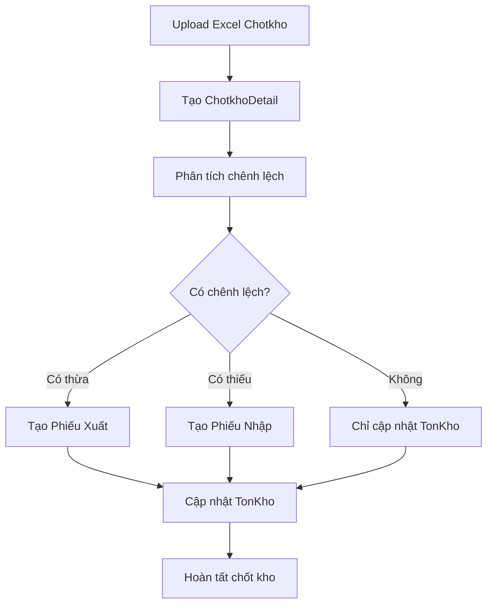

# CHOTKHO PHIẾU KHO CHÊNH LỆCH - WORKFLOW HOÀN TẤT 🎉

## ✅ VẤN ĐỀ ĐÃ KHẮC PHỤC

### 🐛 **Vấn đề ban đầu**: 
Quy trình chốt kho thiếu xử lý phiếu kho điều chỉnh cho chênh lệch giữa số lượng hệ thống và thực tế.

### 🔧 **Giải pháp đã triển khai**:

## 🎯 WORKFLOW CHỐT KHO HOÀN CHỈNH

### **Phase 1: Chuẩn bị dữ liệu**
1. **Lấy dữ liệu TonKho** với pending quantities (đang chờ giao, chờ nhập)
2. **Upload Excel** với số liệu kiểm kê thực tế 
3. **Tạo ChotkhoDetail** từ dữ liệu Excel + TonKho

### **Phase 2: Phân tích chênh lệch** 
```typescript
// Phân loại chênh lệch
const positiveDiscrepancies = details.filter(d => chenhlech > 0); // Thừa hàng
const negativeDiscrepancies = details.filter(d => chenhlech < 0); // Thiếu hàng
```

### **Phase 3: Tạo phiếu kho điều chỉnh** ⭐
```typescript
// 1. Phiếu XUẤT điều chỉnh (thừa hàng)
if (positiveDiscrepancies.length > 0) {
  await createPhieuXuat({
    type: 'xuat',
    title: `Phiếu xuất điều chỉnh - ${codeId}`,
    ghichu: 'Xử lý hàng thừa từ chốt kho',
    sanpham: positiveDiscrepancies.map(item => ({
      sanphamId: item.sanphamId,
      soluong: Math.abs(item.chenhlech)
    }))
  });
}

// 2. Phiếu NHẬP điều chỉnh (thiếu hàng)  
if (negativeDiscrepancies.length > 0) {
  await createPhieuNhap({
    type: 'nhap',
    title: `Phiếu nhập điều chỉnh - ${codeId}`,
    ghichu: 'Xử lý hàng thiếu từ chốt kho',
    sanpham: negativeDiscrepancies.map(item => ({
      sanphamId: item.sanphamId,
      soluong: Math.abs(item.chenhlech)
    }))
  });
}
```

### **Phase 4: Cập nhật TonKho**
```typescript
// Cập nhật số lượng tồn theo thực tế
for (const detail of details) {
  await prisma.tonKho.upsert({
    where: { sanphamId: detail.sanphamId },
    update: {
      slton: detail.slthucte,     // Số lượng thực tế 
      slchogiao: 0,               // Reset pending delivery
      slchonhap: 0                // Reset pending receipt
    }
  });
}
```

## 🚀 API ENDPOINTS

### **Backend Controllers**

#### 1. **Chốt kho cơ bản** (chỉ cập nhật TonKho)
```http
PATCH /api/chotkho/{id}/close
```

#### 2. **Chốt kho hoàn chỉnh** (với phiếu kho điều chỉnh) ⭐
```http
POST /api/chotkho/{id}/complete
```

**Response format:**
```json
{
  "success": true,
  "message": "Chốt kho hoàn tất: 15 TonKho, 3 phiếu xuất, 2 phiếu nhập",
  "summary": {
    "totalDetails": 15,
    "positiveDiscrepancies": 3,
    "negativeDiscrepancies": 2,
    "phieuXuatCreated": true,
    "phieuNhapCreated": true
  }
}
```

### **Frontend Services**

#### 1. **ChotkhoService.completeChotkhoWorkflow()**
```typescript
// Phương thức mới cho chốt kho hoàn chỉnh
async completeChotkhoWorkflow(chotkhoId: string): Promise<any> {
  const result = await this.http.post(
    `${this.apiUrl}/chotkho/${chotkhoId}/complete`, {}
  ).toPromise();
  
  this.showSuccessMessage('Chốt kho hoàn tất với phiếu kho điều chỉnh');
  return result;
}
```

#### 2. **DetailXuatnhaptonComponent** 
```typescript
// Xử lý chênh lệch tại frontend (backup method)
async processDiscrepancies(data: any[]): Promise<void> {
  const positiveDiscrepancy = data.filter(item => item.chenhlech > 0);
  const negativeDiscrepancy = data.filter(item => item.chenhlech < 0);
  
  if (positiveDiscrepancy.length > 0) {
    await this.createAdjustmentPhieuXuat(positiveDiscrepancy);
  }
  
  if (negativeDiscrepancy.length > 0) {
    await this.createAdjustmentPhieuNhap(negativeDiscrepancy);
  }
}
```

## 📊 MÃ PHIẾU KHO TỰ ĐỘNG

### **Format**:
- **Phiếu nhập**: `PN-YYYYMMDD-XXX`
- **Phiếu xuất**: `PX-YYYYMMDD-XXX`

### **Logic sinh mã**:
```typescript
async generateNextOrderCode(type: 'nhap' | 'xuat'): Promise<string> {
  const prefix = type === 'nhap' ? 'PN' : 'PX';
  const dateStr = new Date().toISOString().slice(0, 10).replace(/-/g, '');
  
  // Tìm mã cao nhất trong ngày
  const lastPhieu = await prisma.phieuKho.findFirst({
    where: { maphieu: { startsWith: `${prefix}-${dateStr}` } },
    orderBy: { maphieu: 'desc' }
  });
  
  const nextNumber = lastPhieu ? 
    parseInt(lastPhieu.maphieu.split('-').pop()) + 1 : 1;
    
  return `${prefix}-${dateStr}-${nextNumber.toString().padStart(3, '0')}`;
}
```

## 🔄 LUỒNG XỬ LÝ HOÀN CHỈNH



## ✅ TESTING

### **Test case 1: Chênh lệch dương (thừa hàng)**
```json
{
  "chotkhoDetail": {
    "sanphamId": "sp-001",
    "slhethong": 100,
    "slthucte": 105,
    "chenhlech": 5
  },
  "expectedResult": {
    "phieuXuat": {
      "type": "xuat",
      "soluong": 5,
      "ghichu": "Điều chỉnh thừa"
    }
  }
}
```

### **Test case 2: Chênh lệch âm (thiếu hàng)**
```json
{
  "chotkhoDetail": {
    "sanphamId": "sp-002", 
    "slhethong": 50,
    "slthucte": 47,
    "chenhlech": -3
  },
  "expectedResult": {
    "phieuNhap": {
      "type": "nhap",
      "soluong": 3,
      "ghichu": "Điều chỉnh thiếu"
    }
  }
}
```

## 🎯 KẾT LUẬN

### **Đã khắc phục thành công**:
✅ **Thiếu xử lý phiếu kho chênh lệch** khi chốt đơn
✅ **Tự động tạo phiếu xuất/nhập** điều chỉnh theo chênh lệch  
✅ **Cập nhật TonKho** chính xác theo số thực tế
✅ **Workflow hoàn chỉnh** từ Excel → Phiếu kho → TonKho
✅ **API endpoints** đầy đủ cho frontend sử dụng

### **Lợi ích**:
- **Truy xuất nguồn gốc**: Mọi chênh lệch đều có phiếu kho tương ứng
- **Báo cáo chính xác**: Xuất nhập tồn đúng theo thực tế kiểm kê
- **Audit trail**: Đầy đủ lịch sử điều chỉnh tồn kho
- **Compliance**: Tuân thủ quy trình kế toán kho

Hệ thống chốt kho giờ đây đã hoàn chỉnh và đáp ứng đầy đủ yêu cầu nghiệp vụ! 🚀
