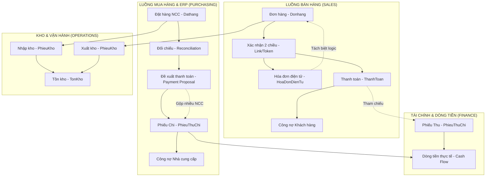

# 🌐 TỔNG QUAN HỆ THỐNG QUẢN LÝ NGHIỆP VỤ (ORDER, PURCHASE, FINANCE & ERP)

Tài liệu này tổng hợp cấu trúc vận hành, luồng dữ liệu và quy tắc nghiệp vụ cốt lõi của hệ thống Rausach V3, bao gồm cả các module hiện có và định hướng nâng cấp ERP.

---

## 1. 🏗️ DIAGRAM TỔNG QUAN HỆ THỐNG

---

## 2. 📑 PHÂN TÍCH CHI TIẾT CÁC NGHIỆP VỤ

### 2.1. Quản lý Đơn hàng & Hóa đơn (Sales & Invoicing)
*   **Xác nhận 2 chiều**: Hệ thống sinh mã `confirmToken` gửi qua link công cộng. Khách hàng xác nhận trực tiếp trên web giúp giảm sai sót đơn giá/số lượng trước khi giao.
*   **Decoupling Architecture (Tách biệt dữ liệu)**:
    *   `Donhang`: Lưu số liệu thật để trừ kho và thu tiền (Công nợ thực).
    *   `HoaDonDienTuDetail`: Lưu số liệu "Snapshot" theo yêu cầu khách hàng (có thể lệch số lượng/đơn giá so với thực tế để phục vụ mục đích khai thuế/nội bộ đối tác) mà không làm hỏng báo cáo Tồn kho & Công nợ thực.

### 2.2. Quản lý Mua hàng & ERP Upgrade (Purchasing)
*   **Luồng nâng cấp**:
    1.  **Dathang**: Đơn đặt mua NCC.
    2.  **Đối chiếu (Reconciliation)**: Kế toán xác nhận số lượng thực nhận từ NCC và đơn giá chốt cuối cùng. Chỉ đơn "Đã Đối Chiếu" mới được đưa vào kế hoạch chi tiền.
    3.  **Đề xuất thanh toán (Proposal)**: Một bản đề xuất gộp nhiều NCC, mỗi NCC gộp nhiều đơn hàng. Đây là bước phê duyệt của Giám đốc.
    4.  **Phiếu Chi**: Khi Proposal được duyệt, hệ thống tự động sinh các Phiếu Chi tương ứng cho từng NCC.

### 2.3. Phiếu Thu Chi & Thanh toán (Finance)
*   **PhieuThuChi**: Quản lý "Sổ quỹ" (Tiền mặt/Ngân hàng).
    *   `Loai: THU` -> Thăng dòng tiền.
    *   `Loai: CHI` -> Giảm dòng tiền.
*   **ThanhToan**: Là hành động "giảm trừ công nợ". 
    *   Một đơn hàng có thể thanh toán nhiều lần.
    *   Một khoản tiền trả gộp có thể phân bổ cho nhiều đơn hàng (Bulk Payment).
*   **Quy tắc**: `Công nợ = Tổng giá trị đơn hàng - Tổng tiền đã thanh toán`.

---

## 3. 🛡️ CÁC QUY TẮC NGHIỆP VỤ CỐT LÕI (BUSINESS RULES)

1.  **Bảo toàn dữ liệu kho**: Mọi thay đổi trên Hóa đơn không được tác động đến số lượng xuất kho của sản phẩm.
2.  **Trạng thái cưỡng bức**:
    *   Đơn hàng chỉ được `hoanthanh` khi `tongtien <= dathanhtoan`.
    *   Phiếu chi cho NCC chỉ được tạo từ Đề xuất đã duyệt (ERP rules).
3.  **Truy vết (Audit Trail)**: Mọi hành động sửa giá, xóa phiếu đều được ghi lại trong `AuditLog` kèm theo IP, User và giá trị cũ/mới.
4.  **Đa chi nhánh/SaaS**: Sử dụng `tenant_id` (hoặc `congtyId`) để tách biệt dữ liệu giữa các kho và pháp nhân khác nhau trong cùng một hệ thống.

---

## 4. 🚀 LỘ TRÌNH TRIỂN KHAI TIẾP THEO (AI-ACCELERATED)

Dựa trên hệ thống hiện có, chúng ta sẽ ưu tiên:
1.  **Giai đoạn 1**: Refactor Schema để hỗ trợ `PaymentProposal` và `tenant_id` toàn diện. (Dự kiến 2-3h).
2.  **Giai đoạn 2**: Xây dựng UI Phê duyệt cho Giám đốc với Audit Timeline mượt mà. (Dự kiến 4-6h).
3.  **Giai đoạn 3**: Tích hợp công cụ in PDF bảo mật từ server. (Dự kiến 1-2h).

---
*Tài liệu được phân tích và tổng hợp tự động bởi AI System.*
