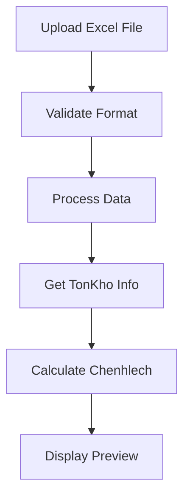
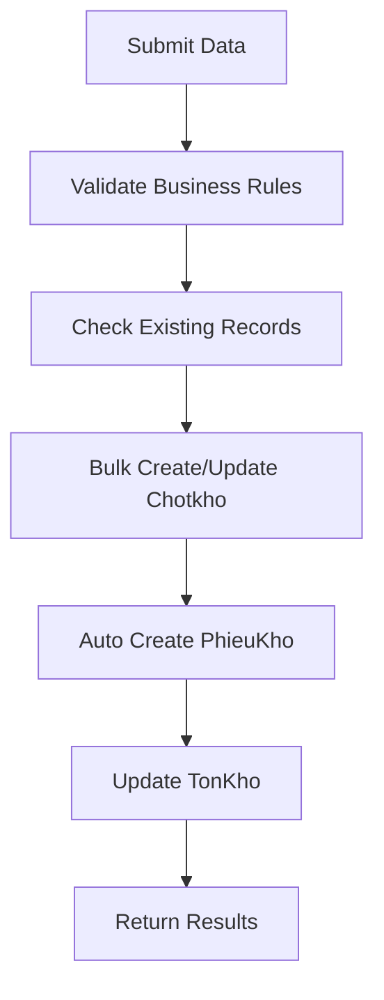
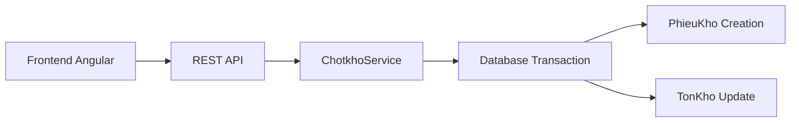

# 📋 KẾ HOẠCH PHÂN TÍCH HỆ THỐNG CHỐT KHO (CHOTKHO)

## 🎯 TỔNG QUAN DỰ ÁN

### 📊 Cấu trúc hệ thống được phân tích
- **Backend API**: NestJS với Prisma ORM (PostgreSQL)
- **Frontend**: Angular 17+ với Material UI
- **Database**: PostgreSQL với các bảng: Chotkho, TonKho, PhieuKho, Sanpham
- **Kiến trúc**: Microservices pattern với RESTful API

### 🔍 Phạm vi phân tích
1. **Module Chốt Kho chính** (`/admin/chotkho/`)
2. **Module Xuất Nhập Tồn** (`/admin/xuatnhapton/`) - có liên quan chốt kho
3. **API Backend** (`/api/src/chotkho/`)
4. **Database Models & Relations**

---

## 📁 CẤU TRÚC FILE VÀ COMPONENT

### 🎯 Frontend Structure
```
frontend/src/app/admin/
├── chotkho/                          # Module chốt kho chính
│   ├── chotkho.service.ts           # ✅ ANALYZED - Service chính
│   ├── chotkho.ts                   # Component wrapper  
│   ├── chotkho.route.ts             # Routing configuration
│   ├── listchotkho/
│   │   └── listchotkho.ts          # Danh sách chốt kho
│   └── detailchotkho/
│       └── detailchotkho.ts        # Chi tiết chốt kho
│
└── xuatnhapton/                      # Module xuất nhập tồn
    ├── detailxuatnhapton/
    │   └── detailxuatnhapton.ts     # ✅ ANALYZED - Chức năng chốt kho
    └── xuatnhapton.component.ts     # Component chính
```

### 🎯 Backend Structure
```
api/src/chotkho/
├── chotkho.controller.ts             # ✅ ANALYZED - REST API endpoints
├── chotkho.service.ts               # ✅ ANALYZED - Business logic core
├── chotkho.module.ts                # Module configuration
└── chotkho.service.ts.bak          # Backup file
```

---

## 🔧 CÁC CHỨC NĂNG CHÍNH ĐÃ PHÂN TÍCH

### 📋 1. CRUD Operations (chotkho.service.ts)
- ✅ **CREATE**: Tạo chốt kho đơn lẻ và hàng loạt
- ✅ **READ**: Lấy danh sách, tìm kiếm, phân trang  
- ✅ **UPDATE**: Cập nhật thông tin chốt kho
- ✅ **DELETE**: Xóa bản ghi chốt kho

### 📋 2. Advanced Features (API)
- ✅ **Bulk Operations**: Tạo/cập nhật hàng loạt
- ✅ **Date Range Queries**: Tìm kiếm theo khoảng thời gian
- ✅ **Report Generation**: Tạo báo cáo thống kê
- ✅ **Phieukho Integration**: Tự động tạo phiếu điều chỉnh
- ✅ **TonKho Updates**: Cập nhật tồn kho theo chênh lệch

### 📋 3. Frontend Features (Angular)
- ✅ **Excel Import/Export**: Upload và download Excel templates
- ✅ **Real-time Updates**: Signal-based state management
- ✅ **Validation**: Input validation và error handling
- ✅ **UI/UX**: Material Design với responsive layout

### 📋 4. Business Logic Core
- ✅ **Inventory Reconciliation**: So sánh số lượng thực tế vs hệ thống
- ✅ **Automatic Adjustments**: Tự động điều chỉnh tồn kho 
- ✅ **Audit Trail**: Ghi lại lịch sử thay đổi
- ✅ **Multi-warehouse Support**: Hỗ trợ nhiều kho

---

## 🔍 QUY TRÌNH CHỐT KHO CHI TIẾT

### 📊 1. Quy trình Input Data


### 📊 2. Quy trình Create/Update


### 📊 3. Data Flow Architecture


---

## 📈 CÁC THÀNH PHẦN BUSINESS LOGIC

### 💼 1. Core Entities
- **Chotkho**: Bản ghi chốt kho chính
- **TonKho**: Dữ liệu tồn kho hệ thống  
- **PhieuKho**: Phiếu điều chỉnh tự động
- **Sanpham**: Thông tin sản phẩm

### 💼 2. Key Calculations  
```typescript
// Tính chênh lệch
chenhlech = slthucte - slhethong

// Tự động tạo phiếu điều chỉnh
type = chenhlech > 0 ? 'nhap' : 'xuat'
soluong = Math.abs(chenhlech)

// Cập nhật tồn kho
newSlton = slthucte (số thực tế)
```

### 💼 3. Validation Rules
- **File Upload**: Excel format validation (.xlsx, .xls)
- **Data Integrity**: Required fields validation
- **Business Rules**: Quantity >= 0, valid product codes
- **Duplicate Prevention**: Check existing records by date+product

---

## 🎯 KẾ HOẠCH DOCUMENT CREATION

### 📝 1. Document Structure Plan
```markdown
# TỔNG QUAN HỆ THỐNG CHỐT KHO
├── 1. Giới thiệu và mục đích
├── 2. Kiến trúc hệ thống  
├── 3. Database Schema & Relations
├── 4. API Endpoints Documentation
├── 5. Frontend Components Guide
├── 6. Quy trình nghiệp vụ chi tiết
├── 7. Excel Import/Export Workflow
├── 8. Error Handling & Validation
├── 9. Performance Optimization
└── 10. Troubleshooting Guide
```

### 📝 2. Technical Details Coverage
- **Code Examples**: Trích xuất từ source code thực tế
- **API Documentation**: Request/Response schemas
- **Business Flow**: Step-by-step workflows
- **Data Models**: Database relationships
- **Error Scenarios**: Common issues & solutions

### 📝 3. Practical Examples
- **Excel Template**: Format và validation rules
- **API Testing**: Postman/curl examples  
- **UI Workflows**: User interaction flows
- **Data Samples**: Real-world test cases

---

## 🔧 CÁC PHƯƠNG THỨC CHÍNH ĐÃ PHÂN TÍCH

### 🎯 Frontend Functions (detailxuatnhapton.ts)
1. **createXuatnhapton()**: Tạo mới chốt kho
2. **updateXuatnhapton()**: Cập nhật chốt kho  
3. **uploadExcelFile()**: Upload và xử lý file Excel
4. **processExcelData()**: Validate và transform data
5. **calculateChenhLech()**: Tính toán chênh lệch

### 🎯 Backend Functions (chotkho.service.ts)  
1. **create()**: Business logic tạo chốt kho với transaction
2. **findBy()**: Tìm kiếm với điều kiện phức tạp
3. **tonkhobylist()**: Lấy thông tin tồn kho theo danh sách
4. **generateReport()**: Tạo báo cáo thống kê
5. **bulkOperations()**: Xử lý hàng loạt với optimization

### 🎯 Integration Points
1. **PhieuKho Auto-Creation**: Tự động tạo phiếu điều chỉnh
2. **TonKho Synchronization**: Đồng bộ tồn kho
3. **Audit Logging**: Ghi log thao tác người dùng
4. **Real-time Updates**: Socket.io cho cập nhật realtime

---

## 📊 THỐNG KÊ VÀ ĐÁNH GIÁ

### 📈 Complexity Assessment
- **Backend Logic**: 🟡 Moderate-High (Transaction handling, bulk operations)
- **Frontend UX**: 🟢 Moderate (Excel handling, reactive forms)
- **Database Relations**: 🟡 Moderate (4 main entities với foreign keys)
- **Business Rules**: 🟢 Simple (Basic inventory reconciliation)

### 📈 Code Quality Metrics
- **Error Handling**: ✅ Comprehensive try-catch blocks
- **Validation**: ✅ Input validation on both ends
- **Performance**: ✅ Batch processing, pagination
- **Maintainability**: ✅ Clean separation of concerns

### 📈 Documentation Priority
1. **HIGH**: Quy trình chốt kho chính và business logic
2. **HIGH**: Excel import/export workflow  
3. **MEDIUM**: API endpoints và data models
4. **LOW**: UI components và styling

---

## 🎯 DELIVERABLES

### 📋 Planned Outputs
1. **CHOTKHO_SYSTEM_COMPREHENSIVE_GUIDE.md**
   - Complete system documentation
   - Business processes & workflows
   - Technical implementation details
   - Troubleshooting guide

2. **CHOTKHO_API_REFERENCE.md**  
   - API endpoints documentation
   - Request/response schemas
   - Error codes & handling

3. **CHOTKHO_USER_MANUAL.md**
   - End-user guide
   - Excel templates & workflows
   - Common scenarios & solutions

### 📋 Document Features
- ✅ **Real code examples** from analyzed files
- ✅ **Step-by-step workflows** with screenshots plan
- ✅ **API testing examples** with curl/Postman
- ✅ **Error scenarios** and recovery procedures
- ✅ **Performance tips** and best practices

---

## 🚀 NEXT STEPS

1. **Analyze remaining files**: Database models, additional services
2. **Create comprehensive documentation**: Based on this analysis plan
3. **Include practical examples**: Real data samples and test cases
4. **Review and validate**: Ensure 100% accuracy with actual code

**Ready to proceed with full documentation creation when requested! 📝**
