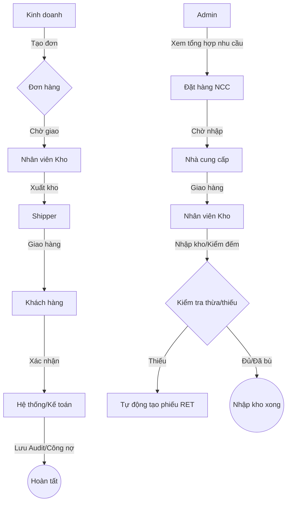

# Báo Cáo Quy Trình Hệ Thống Đơn Hàng & Đặt Hàng

Tài liệu này tổng hợp chi tiết các quy trình nghiệp vụ, các bước tương tác của người dùng (User Persona) và các thành phần giao diện (UI/UX) tương ứng trong hệ thống quản lý **KataChannel/rausachfinal**.

---

## 1. Các Vai Trò Người Dùng (User Personas)

| Vai trò | Trách nhiệm chính |
| :--- | :--- |
| **Kinh doanh / Admin** | Tiếp nhận yêu cầu, tạo đơn hàng, quản lý chính sách giá và khách hàng. |
| **Nhân viên Kho** | Thực hiện xuất/nhập kho, kiểm đếm hàng hóa, quản lý tồn kho thực tế. |
| **Shipper / Giao nhận** | Vận chuyển hàng hóa đến khách hàng, xác nhận tình trạng giao nhận. |
| **Kế toán** | Đối soát công nợ khách hàng, công nợ nhà cung cấp, xử lý hóa đơn (VAT). |
| **Hệ thống (System/Cron)** | Tự động hóa các tác vụ lặp lại (cập nhật trạng thái, lưu vết audit). |

---

## 2. Danh sách Trạng thái Đơn hàng & Đặt hàng

Hệ thống sử dụng một bộ trạng thái nhất chuẩn cho cả `Donhang` (Khách hàng) và `Dathang` (Nhà cung cấp).

| Mã trạng thái | Tên hiển thị | Ý nghĩa nghiệp vụ |
| :--- | :--- | :--- |
| **`dadat`** | Đơn mới | Đơn hàng vừa khởi tạo, đang chờ chuẩn bị hàng/nhập hàng. |
| **`dagiao`** | Đang giao | Hàng đã xuất kho (PX) hoặc NCC đã giao hàng, đang trên đường vận chuyển. |
| **`danhan`** | Đã nhận | Khách hàng đã nhận hàng hoặc Kho đã nhận hàng từ NCC. Bắt đầu đối soát. |
| **`hoanthanh`** | Hoàn thành | Đã đối soát xong công nợ, giao dịch kết thúc hoàn toàn. |
| **`huy`** | Đã hủy | Đơn hàng bị hủy bỏ (do khách hủy hoặc lỗi cung ứng). |

---
+
+## 3. Quy Trình Đơn Hàng Khách Hàng (Sales Order Workflow)
+
+Quy trình này quản lý từ lúc khách hàng đặt hàng đến khi hoàn tất thanh toán và giao nhận.

### Bước 1: Khởi tạo Đơn hàng (`dadat`)
- **Người thực hiện**: Nhân viên Kinh doanh.
- **Tương tác UX/UI**:
    - Truy cập trang **"Quản lý đơn hàng"**, nhấn **"Tạo mới"**.
    - **Form tạo đơn**: Tự động gợi ý khách hàng. Khi chọn khách hàng, UI tự động tải **Bảng giá** áp dụng riêng cho khách đó.
    - Chọn sản phẩm: Hệ thống tính toán tổng tiền, VAT dựa trên cấu hình của khách hàng.
- **Hệ quả hệ thống**:
    - Tạo bản ghi `Donhang` và `Donhangsanpham`.
    - Tăng số lượng **Chờ giao (`slchogiao`)** trong Tồn kho để bộ phận thu mua chuẩn bị hàng.

### Bước 2: Chuẩn bị & Giao hàng (`dagiao`)
- **Người thực hiện**: Nhân viên Kho & Shipper.
- **Tương tác UX/UI**:
    - UI **"Điều phối giao hàng"**: Danh sách các đơn đã đặt.
    - Nhấn **"Xuất kho"**: Chuyển trạng thái sang `dagiao`.
    - **In phiếu**: Hệ thống xuất **Phiếu giao hàng (PDF/Excel)** kèm mã QR/Barcode.
- **Hệ quả hệ thống**:
    - Trừ **Chờ giao (`slchogiao`)** và trừ **Tồn kho thực tế (`slton`)**.
    - Tự động tạo **Phiếu Xuất Kho (`PX-...`)**.

### Bước 3: Hoàn tất & Đối soát (`danhan`)
- **Người thực hiện**: Hệ thống (Cron Job) hoặc Kế toán.
- **Tương tác UX/UI**:
    - **Cron Job**: Tự động quét và chuyển trạng thái lúc 13:00 hàng ngày.
    - **Trang Công Nợ**: Hiển thị danh sách các đơn `danhan` để kế toán đối soát tiền về.
- **Hệ quả hệ thống**: Ghi nhận doanh thu chính thức, cập nhật sổ cái công nợ khách hàng.

---

## 4. Quy Trình Đặt Hàng Nhà Cung Cấp (Purchase Order Workflow)

Quy trình đảm bảo nguồn cung đầu vào dựa trên nhu cầu thực tế.

### Bước 1: Tổng hợp nhu cầu & Đặt hàng
- **Người thực hiện**: Admin / Mua hàng.
- **Tương tác UX/UI**:
    - Truy cập **"Tổng hợp nhu cầu"**: Hệ thống hiển thị tổng lượng hàng cần giao (từ `getchogiao`).
    - Nhấn **"Tạo đơn đặt hàng NCC"**: Form tự động đổ dữ liệu sản phẩm thiếu.
- **Hệ quả hệ thống**: Tạo bản ghi `Dathang`, tăng **Chờ nhập (`slchonhap`)**.

### Bước 2: Xác nhận giao hàng từ NCC (`dagiao`)
- **Người thực hiện**: Nhân viên Kho.
- **Tương tác UX/UI**: Khi NCC báo gửi hàng, người dùng cập nhật trạng thái đơn đặt sang `dagiao`.
- **Hệ quả hệ thống**: Giảm **Chờ nhập (`slchonhap`)**, chuẩn bị vị trí kho để nhận hàng.

### Bước 3: Nhập kho & Kiểm đếm (`danhan`)
- **Người thực hiện**: Nhân viên Kho.
- **Tương tác UX/UI**:
    - **Giao diện Đối soát nhập**: Nhập số lượng thực nhận (`slnhan`) cho từng dòng sản phẩm.
    - Nếu có chênh lệch (thiếu hàng), UI sẽ cảnh báo.
- **Hệ quả hệ thống**:
    - Tăng **Tồn kho thực tế (`slton`)**.
    - **Xử lý sai lệch**: Nếu `slnhan` < `slgiao`, hệ thống tự động tạo **Phiếu hàng trả về (`RET`)** để cấn trừ công nợ NCC ngay lập tức.

---

## 5. Các Tính Năng Bổ Trợ UX/UI Cao Cấp

| Tính năng | Mô tả UX/UI | Lợi ích |
| :--- | :--- | :--- |
| **Audit Trail Dashboard** | Danh sách lịch sử thay đổi (Giá, Trạng thái) có màu sắc phân biệt (Xanh: tăng, Đỏ: giảm). | Minh bạch trong quản lý, dễ dàng truy vết sai sót. |
| **Excel Export Engine** | Xuất báo cáo công nợ chỉ với 1 click, định dạng chuẩn kế toán. | Tiết kiệm thời gian báo cáo cho kế toán hàng tháng. |
| **Real-time Stock Map** | Biểu đồ theo dõi Tồn kho thực tế vs Chờ giao vs Chờ nhập. | Giúp quản trị viên có cái nhìn tổng thể về dòng hàng (Inventory Flow). |
| **Quick Action Modals** | Các hành động nhanh (Đổi trạng thái bulk, cập nhật giá nhanh). | Tăng tốc độ xử lý khi có hàng trăm đơn hàng mỗi ngày. |

---

## 6. Bảng Phân quyền & Vai trò chi tiết (Access Control List)

Hệ thống phân quyền dựa trên mã định danh (Permission Code) được gán cho từng Vai trò (Role).

| Nhóm chức năng | Mã quyền (Gợi ý) | Mô tả quyền hạn |
| :--- | :--- | :--- |
| **Đơn hàng** | `donhang.view`, `donhang.create` | Xem danh sách và tạo đơn hàng mới. |
| | `donhang.update`, `donhang.delete` | Chỉnh sửa nội dung đơn và xóa đơn (khi ở trạng thái `dadat`). |
| | `donhang.status_transition` | Chuyển trạng thái đơn (ví dụ: từ `dadat` → `dagiao`). |
| **Đặt hàng NCC** | `dathang.view`, `dathang.create` | Lập kế hoạch nhập hàng và tạo đơn đặt NCC. |
| | `dathang.receive` | Xác nhận nhận hàng và kiểm đếm từ NCC. |
| **Kho hàng** | `kho.view`, `tonkho.view` | Kiểm tra tồn kho thực tế, chờ giao, chờ nhập. |
| | `phieukho.manage` | Quản lý, in ấn các phiếu xuất/nhập kho. |
| **Công nợ** | `congno.view`, `congno.export` | Xem báo cáo tổng hợp công nợ và xuất file Excel. |
| **Cấu hình** | `banggia.manage` | Điều chỉnh giá sản phẩm áp dụng cho từng khách hàng. |
| | `user.manage` | Quản lý tài khoản nhân viên và phân quyền. |

---

## 7. Bản đồ Tương tác Người dùng (User Interaction Map)

---
*Báo cáo được tạo tự động bởi hệ thống Antigravity - 2026.*
