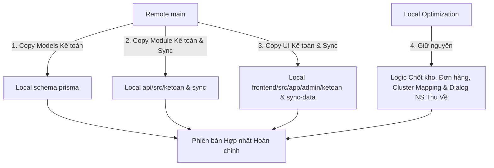

# BÁO CÁO SO SÁNH PHIÊN BẢN HỆ THỐNG RAUSACH ERP

**Mã nguồn Local:** `/home/kata/Coding/rausachcophan`  
**GitHub Remote:** `https://github.com/Mk141121/rausach-erp/tree/main`  
**Ngày lập báo cáo:** 28/07/2026  

---

## 📌 TỔNG QUAN VỀ SỰ KHÁC BIỆT

Mã nguồn local (`/home/kata/Coding/rausachcophan`) và nhánh `main` trên GitHub repository (`Mk141121/rausach-erp`) hiện tại có sự phân hóa rõ rệt về mặt tính năng và mục tiêu tối ưu:

1. **Phiên bản GitHub Remote (`main`)**:
   - **Bổ sung Phân hệ Kế toán & Sổ sách Công nợ (Accounting Subsystem)** hoàn chỉnh với 12 Prisma Models mới, SQL scripts khởi tạo/chốt sổ, NestJS API module Kế toán (`api/src/ketoan`), giao diện Angular Kế toán (`frontend/src/app/admin/ketoan`) và hệ thống kịch bản test công nợ.
   - **Bổ sung Phân hệ Đồng bộ dữ liệu (Sync Module)**: Backend API `api/src/sync` và Giao diện `frontend/src/app/admin/sync-data`.
   - **Giao diện Giám sát Hiệu năng**: `frontend/src/app/admin/performance`.

2. **Phiên bản Local (`/home/kata/Coding/rausachcophan`)**:
   - **Tối ưu hóa Phân hệ Chốt Kho & Tồn Kho Baseline (`chotkho.service.ts`)**: Chứa các thuật toán xử lý batch dữ liệu lớn, tính toán tồn kho động từ log giao dịch, chuẩn hóa baseline, xử lý kho tổng/kho nhánh.
   - **Phân chùm Phiếu Chia Hàng (Cluster Mapping)**: Bổ sung tính năng phân chùm khách hàng (Cluster 1-9) tự động trên giao diện chia hàng (`listphieuchiahang.component.ts` & `cluster-mapping.constant.ts`).
   - **Quản lý Phiếu Giao Hàng (NS Thu Về Dialog)**: Tích hợp Dialog tổng hợp kết quả Import Nông Sản Thu Về (`ImportNSThuVeSummaryDialogComponent`).
   - **Hệ thống Scripts Vận hành & Bảo trì Nội bộ**: Hơn 30+ kịch bản kiểm tra/đối soát kho (`audit_warehouse_*.js`), kiểm tra lỗi voucher (`fix-duplicate-voucher.ts`), dọn dẹp cơ sở dữ liệu (`vacuum-database.ts`), tool MCP backend (`mcp_server.ts`) và các báo cáo đối soát chốt kho chi tiết (`report/REPORT_CHOT_BASELINE_*.md`).

---

## 🛠️ CHI TIẾT SỰ KHÁC BIỆT THEO THÀNH PHẦN

### 1. Cơ sở Dữ liệu & Prisma Schema (`api/prisma/schema.prisma`)

| Thành phần | Phiên bản Local | Phiên bản Remote (`main`) | Chi tiết / Đánh giá |
| :--- | :--- | :--- | :--- |
| **Tổng số Models** | 35 Models cơ bản | 47 Models (+12 Models Kế toán) | Remote bổ sung toàn bộ cấu trúc DB Kế toán |
| **Enum mới** | Các Enum hệ thống | Thêm `enum LoaiThuChi` | Phục vụ phân loại Thu / Chi |
| **Models Kế toán (Chỉ có trên Remote)** | Không có | `ButToan`, `ButToanChiTiet`, `ChotCongNo`, `ChotCongNoChiTiet`, `CongNoDauKy`, `CongNoGiaoDich`, `HoaDon`, `HoaDonMuaVao`, `KhoaSoKeToan`, `LienheKhachhang`, `PhieuThuChi`, `TaiKhoan` | Hỗ trợ hạch toán bút toán kép, chốt kỳ công nợ, quản lý hóa đơn & phiếu thu chi |

---

### 2. NestJS Backend API (`api/src/`)

#### A. Các Phân hệ Chỉ có trên Remote GitHub (`main`)
- `api/src/ketoan/`: Module Kế toán (Controllers, Services, Resolvers) xử lý hạch toán, sổ quỹ, khóa sổ, công nợ khách hàng & nhà cung cấp.
- `api/src/sync/`: Module Đồng bộ dữ liệu nâng cao giữa các hệ thống ERP / POS.
- Các file SQL khởi tạo kế toán (`api/prisma/ketoan-*.sql`).
- Kịch bản chạy test kế toán (`api/scripts/test-ketoan*.ts`, `import-congno-dauky.js`, `gen-template-congno-dauky.js`).

#### B. Các Phân hệ Tối ưu Nâng cao Chỉ có ở Local
- **`api/src/chotkho/chotkho.service.ts` (`+1018 / -271` dòng)**:
  - Thuật toán **Batch Pre-fetch** tồn kho từ các phiên chốt trước để tăng tốc độ đối soát.
  - Phân loại sản phẩm theo quy tắc baseline (Trường hợp A: có trong Excel, Trường hợp B: không có trong Excel).
  - Hàm tính toán tồn kho hệ thống động dựa trên lịch sử xuất/nhập thực tế từ Log.
- **`api/src/donhang/donhang.service.ts` (`+3920 / -3664` dòng)**:
  - Logic phát sinh mã đơn hàng tự động nối tiếp dạng alpha-numeric (`TG-AA00001` → `TG-ZZ99999`).
  - Xử lý múi giờ Việt Nam (+07:00) trực tiếp từ UTC chuẩn xác.
  - Giới hạn phân trang an toàn (Pagination Cap 1000 items).
- **`api/src/dathang/dathang.service.ts` (`+965 / -273` dòng)**:
  - Tối ưu thuật toán gợi ý đặt hàng (tính toán bù đắp âm/dương thực tế, loại bỏ giá trị tuyệt đối không cần thiết).
  - Sử dụng mốc thời gian chốt kho kho HCM làm tham chiếu hệ thống toàn cục.
- **`api/src/common/tonkho-manager.service.ts` (`+141 / -49` dòng)**:
  - Logic Mirroring tồn kho: Cập nhật tồn kho riêng từng kho đồng thời đồng bộ về `KHO TỔNG` (coi Kho Tổng là Single Source of Truth).
- **`api/src/graphql/enhanced-universal.service.ts` & `universal.service.ts` (`+79` dòng)**:
  - Bổ sung xử lý thao tác soft delete, tìm kiếm nâng cao `findFirst` và khôi phục dữ liệu hàng loạt.

#### C. Scripts Vận hành Nội bộ (Local Only)
- `api/scripts/vacuum-database.ts` & `vacuum-tables.ts`: Tối ưu hóa dung lượng PostgreSQL.
- `api/scripts/mcp_server.ts`: Server tích hợp Model Context Protocol.
- `api/scripts/audit_warehouse_*.js`: Tập hợp công cụ kiểm tra sức khỏe và biến động tồn kho.
- `api/scripts/fix-duplicate-voucher*.ts`: Xử lý voucher trùng lặp.
- `api/scratch_*.js` / `scratch_*.ts`: Các file kiểm tra quyền, audit log, PO, đơn hàng.

---

### 3. Angular Frontend (`frontend/src/app/`)

#### A. Tính năng Chỉ có trên Remote GitHub (`main`)
- **Phân hệ Kế toán (`frontend/src/app/admin/ketoan/`)**:
  - `congno-kh`: Quản lý công nợ khách hàng.
  - `soquy`: Quản lý thu chi sổ quỹ.
  - `chotcongno`: Giao diện chốt kỳ công nợ.
  - `quydoi`: Quy đổi giá vốn / đơn vị.
  - `dauky`: Nhập và quản lý công nợ đầu kỳ.
- **Phân hệ Đồng bộ (`frontend/src/app/admin/sync-data/`)**: Giao diện đồng bộ dữ liệu.
- **Phân hệ Performance (`frontend/src/app/admin/performance/`)**: Màn hình theo dõi hiệu năng hệ thống.

#### B. Tính năng Nâng cấp & Tối ưu trên Local
- **Phiếu Chia Hàng (`listphieuchiahang.component.ts`)**:
  - Tích hợp file hằng số `cluster-mapping.constant.ts` tự động phân nhóm khách hàng theo Cluster 1 đến 9.
  - Bổ sung bộ lọc Tab Cluster trực quan trên giao diện.
- **Phiếu Giao Hàng (`listphieugiaohang.component.ts`)**:
  - Bổ sung `ImportNSThuVeSummaryDialogComponent` hiển thị Dialog tổng hợp chi tiết kết quả Import Nông Sản Thu Về từ Excel.
- **Quản lý Chốt Kho (`chotkho.service.ts` & `detailchotkho`)**:
  - Giao diện hỗ trợ chốt kho nâng cao và đối soát chênh lệch baseline.
- **Xuất Nhập Tồn (`xuatnhapton.component.ts`)**:
  - Tối ưu hiển thị và tính toán xuất nhập tồn kho.

---

### 4. Cấu hình & Deploy (Root Files & Scripts)

| Tệp tin | Local | Remote (`main`) | Ghi chú |
| :--- | :--- | :--- | :--- |
| `docker-compose.yml` | Đã tối ưu hóa container bindings, volume mapping backup và proxy nội bộ | Cấu hình Docker chuẩn gốc | Local sẵn sàng cho môi trường production/staging local |
| `run_dev.sh` | Cập nhật lệnh chạy Bun/Node và quản lý tiến trình | Lệnh chạy dev chuẩn | Local hỗ trợ chạy nhanh với Bun |
| `scripts/deploy_safe_local.sh` | Có kịch bản deploy an toàn & script `restore_to_vps.sh` | Không có script restore VPS | Sẵn sàng cho việc khôi phục dữ liệu VPS |
| `report/` | Lưu trữ báo cáo chốt kho baseline chi tiết | Không có folder report này | Phục vụ kiểm toán số liệu tồn kho |

---

## 💡 ĐỀ XUẤT HƯỚNG HỢP NHẤT (MERGE STRATEGY)

Để hợp nhất thành công hai phiên bản mà giữ trọn vẹn cả **Phân hệ Kế toán mới (trên Remote)** và **Các thuật toán Tối ưu Kho & Chia hàng (ở Local)**:

1. **Bước 1 (Database)**: Cập nhật `schema.prisma` ở Local bằng cách copy 12 Prisma Models Kế toán từ Remote vào Local, sau đó chạy `npx prisma generate`.
2. **Bước 2 (Backend)**: Copy toàn bộ hai thư mục `api/src/ketoan` và `api/src/sync` từ Remote sang Local. Giữ nguyên các service tối ưu ở Local (`chotkho.service.ts`, `donhang.service.ts`, `dathang.service.ts`, `tonkho-manager.service.ts`).
3. **Bước 3 (Frontend)**: Copy `frontend/src/app/admin/ketoan` và `frontend/src/app/admin/sync-data` từ Remote sang Local. Cập nhật `app.routes.ts` để bổ sung các tuyến đường Kế toán.
4. **Bước 4 (Testing & Verification)**: Chạy ứng dụng dev và kiểm tra tích hợp cả hai phân hệ.
