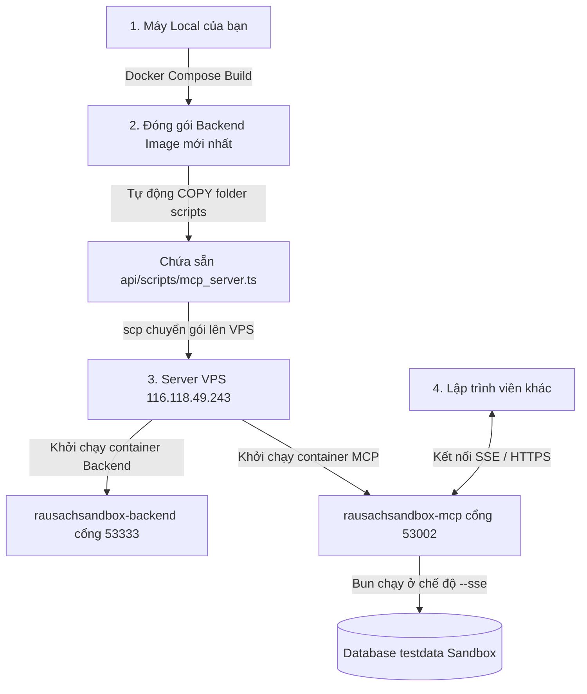

# Báo Cáo Triển Khai MCP Tối Ưu Cho Dự Án Rausach (Bản Dual Transport: Stdio & SSE)

## 1. Tổng Quan Kiến Trúc & Thiết Kế Bảo Mật

Hệ thống **Model Context Protocol (MCP)** của dự án `rausachfinal` được triển khai theo mô hình **Dual Transport** cực kỳ linh hoạt và tối ưu. Server hỗ trợ đồng thời hai hình thức kết nối độc lập:
1.  **Stdio Transport (Mặc định):** Phù hợp tuyệt đối cho cá nhân lập trình viên kết nối trực tiếp trong môi trường Local (Cursor, Claude Desktop).
2.  **SSE Transport (Server-Sent Events / HTTP):** Cho phép triển khai tập trung trên **VPS Sandbox** (Cổng `53002`), giúp tất cả các lập trình viên khác trong dự án kết nối dùng chung dữ liệu một cách an toàn và bảo mật cao thông qua khóa **API Key**.

### Các tính năng bảo mật nổi bật:
*   **Strictly Read-Only (Chỉ đọc dữ liệu):** Server không chứa bất kỳ lệnh ghi nào (không `create`, `update`, `delete`), bảo đảm an toàn tuyệt đối 100% cho cơ sở dữ liệu gốc (kể cả database Sandbox hay Production).
*   **Zero Shell Execution:** Đã loại bỏ hoàn toàn các thư viện gọi tiến trình bên ngoài (`child_process`/`exec`), chặn đứng mọi hành vi thực thi lệnh shell từ AI.
*   **API Key Protection:** Kênh SSE được bảo vệ bằng khóa truy cập `RS_SECRET_DEVELOPER_KEY_2026` truyền qua Header `X-API-KEY` hoặc Query Parameter `apiKey`.

---

## 2. Sơ Đồ Quy Trình Tự Động Triển Khai Sandbox

Khi bạn thực hiện lệnh:
👉 **`bun dev`** -> Chọn **`9. Triển khai Sandbox`** -> Chọn **`3. Sandbox Deploy`**

Quy trình tự động hóa sẽ diễn ra như sau:



---

## 3. Mã Nguồn MCP Server Hỗ Trợ Dual Transport (`api/scripts/mcp_server.ts`)

Mã nguồn dưới đây được tích hợp trực tiếp vào tệp của bạn, tự động phân tách chế độ hoạt động thông qua đối số truyền vào `--sse`:

```typescript
// api/scripts/mcp_server.ts
import { Server } from "@modelcontextprotocol/sdk/server/index.js";
import { StdioServerTransport } from "@modelcontextprotocol/sdk/server/stdio.js";
import { SSEServerTransport } from "@modelcontextprotocol/sdk/server/sse.js";
import {
  CallToolRequestSchema,
  ListToolsRequestSchema,
} from "@modelcontextprotocol/sdk/types.js";
import { PrismaClient } from "@prisma/client";
import express from "express";
import * as xlsx from "xlsx";
import * as path from "path";
import * as fs from "fs";

// Cấu hình đường dẫn
const API_DIR = path.resolve(__dirname, "..");
const ROOT_DIR = path.resolve(API_DIR, "..");
const ENV_FILE = path.join(API_DIR, ".env");

// Load .env để lấy kết nối cơ sở dữ liệu
if (fs.existsSync(ENV_FILE)) {
  const envContent = fs.readFileSync(ENV_FILE, "utf-8");
  for (const line of envContent.split("\n")) {
    const match = line.match(/^\s*DATABASE_URL\s*=\s*["']?(.*?)["']?\s*$/);
    if (match) {
      process.env.DATABASE_URL = match[1];
      break;
    }
  }
}

const prisma = new PrismaClient();

// Khởi tạo MCP Server
const server = new Server(
  {
    name: "rausach-optimized-mcp",
    version: "1.0.0",
  },
  {
    capabilities: {
      tools: {},
    },
  }
);

// Đăng ký danh sách các Tools chỉ đọc và chẩn đoán
server.setRequestHandler(ListToolsRequestSchema, async () => {
  return {
    tools: [
      {
        name: "check_stock_discrepancy",
        description: "Kiểm tra chênh lệch số lượng tồn kho giữa SanphamKho (HCM) và TonKho toàn cục (Chỉ đọc).",
        inputSchema: {
          type: "object",
          properties: {},
        },
      },
      {
        name: "check_optimization_diagnostics",
        description: "Quét và phân tích các chỉ số sản phẩm cần tối ưu hóa, như số lượng âm kho hoặc giá bán bằng 0 (Chỉ đọc, bảo mật cao).",
        inputSchema: {
          type: "object",
          properties: {},
        },
      },
      {
        name: "read_delivery_excel",
        description: "Đọc và phân tích file Excel phiếu kiểm kho/phiếu giao hàng nằm trong docs/xuly (Chỉ đọc).",
        inputSchema: {
          type: "object",
          properties: {
            fileName: { 
              type: "string", 
              description: "Tên file Excel trong docs/xuly (ví dụ: KT PHIẾU GIAO HÀNG TRAN GIA.xlsx)",
              default: "KT PHIẾU GIAO HÀNG TRAN GIA.xlsx"
            }
          }
        },
      },
      {
        name: "export_stock_report",
        description: "Xuất báo cáo tổng hợp chi tiết dạng JSON về tình trạng tồn kho hiện tại (Chỉ đọc).",
        inputSchema: {
          type: "object",
          properties: {},
        },
      }
    ],
  };
});

// Xử lý logic gọi Tool
server.setRequestHandler(CallToolRequestSchema, async (request) => {
  const { name, arguments: args } = request.params;

  try {
    if (name === "check_stock_discrepancy") {
      const khoId = "4cc01811-61f5-4bdc-83de-a493764e9258"; // HCM Warehouse ID
      
      const products = await prisma.sanpham.findMany({
        select: {
          id: true,
          masp: true,
          title: true,
          SanphamKho: { where: { khoId } },
          TonKho: true,
        }
      });

      const discrepancies: any[] = [];
      for (const p of products) {
        const slKho = p.SanphamKho[0] ? Number(p.SanphamKho[0].soluong) : 0;
        const slTonKho = p.TonKho ? Number(p.TonKho.slton) : 0;
        
        if (Math.abs(slKho - slTonKho) > 0.001) {
          discrepancies.push({
            masp: p.masp,
            title: p.title,
            slSanphamKho: slKho,
            slTonKho: slTonKho,
            chenhlech: slKho - slTonKho
          });
        }
      }

      return {
        content: [{
          type: "text",
          text: JSON.stringify({
            message: `Tìm thấy ${discrepancies.length} sản phẩm bị lệch số lượng tồn giữa 2 bảng`,
            discrepancies: discrepancies.slice(0, 50)
          }, null, 2)
        }]
      };
    }

    if (name === "check_optimization_diagnostics") {
      const totalProducts = await prisma.sanpham.count();
      
      const negativeStockKho = await prisma.sanphamKho.count({
        where: { soluong: { lt: 0 } }
      });
      const negativeStockGlobal = await prisma.tonKho.count({
        where: { slton: { lt: 0 } }
      });

      const zeroBasePrice = await prisma.sanpham.count({
        where: { giagoc: 0 }
      });
      const zeroSellPrice = await prisma.sanpham.count({
        where: { giaban: 0 }
      });

      return {
        content: [{
          type: "text",
          text: JSON.stringify({
            status: "SUCCESS",
            message: "Báo cáo chỉ số chẩn đoán hệ thống (Không ghi đè dữ liệu)",
            metrics: {
              totalProductsInDB: totalProducts,
              negativeStockInHCMWarehouse: negativeStockKho,
              negativeStockInGlobalInventory: negativeStockGlobal,
              productsWithZeroBasePrice: zeroBasePrice,
              productsWithZeroSellPrice: zeroSellPrice,
            },
            recommendation: (negativeStockKho > 0 || negativeStockGlobal > 0)
              ? "Hệ thống có sản phẩm bị âm kho. Hãy chạy kịch bản 'Tối ưu hóa sản phẩm' thông qua menu hệ thống của admin (Lựa chọn 6 trong run_dev.sh) để tự động sửa chênh lệch này."
              : "Dữ liệu tồn kho ở trạng thái bình thường."
          }, null, 2)
        }]
      };
    }

    if (name === "read_delivery_excel") {
      const fileName = (args?.fileName as string) || "KT PHIẾU GIAO HÀNG TRAN GIA.xlsx";
      const filePath = path.join(ROOT_DIR, "docs", "xuly", fileName);

      if (!fs.existsSync(filePath)) {
        return {
          isError: true,
          content: [{ type: "text", text: `Không tìm thấy file Excel tại đường dẫn: ${filePath}` }]
        };
      }

      const workbook = xlsx.readFile(filePath);
      const sheetName = workbook.SheetNames[0];
      const worksheet = workbook.Sheets[sheetName];
      const rawData = xlsx.utils.sheet_to_json(worksheet);

      return {
        content: [{
          type: "text",
          text: JSON.stringify({
            file: fileName,
            totalRows: rawData.length,
            preview: rawData.slice(0, 15)
          }, null, 2)
        }]
      };
    }

    if (name === "export_stock_report") {
      const allStock = await prisma.sanpham.findMany({
        select: {
          masp: true,
          title: true,
          giagoc: true,
          giaban: true,
          SanphamKho: { select: { soluong: true } },
          TonKho: { select: { slton: true } }
        }
      });

      const reportData = allStock.map(p => ({
        masp: p.masp,
        title: p.title,
        giagoc: Number(p.giagoc) || 0,
        giaban: Number(p.giaban) || 0,
        tonKhoHCM: p.SanphamKho[0] ? Number(p.SanphamKho[0].soluong) : 0,
        tonKhoToanCuc: p.TonKho ? Number(p.TonKho.slton) : 0
      }));

      return {
        content: [{
          type: "text",
          text: JSON.stringify({
            exportedAt: new Date().toISOString(),
            totalProductsExported: reportData.length,
            products: reportData.slice(0, 100)
          }, null, 2)
        }]
      };
    }

    throw new Error(`Tool không hợp lệ: ${name}`);
  } catch (error: any) {
    return {
      isError: true,
      content: [{ type: "text", text: `Lỗi khi chạy tool ${name}: ${error.message}` }]
    };
  }
});

// Khởi chạy kết nối theo phân loại Giao thức
async function start() {
  const isSse = process.argv.includes("--sse");

  if (isSse) {
    const app = express();
    const PORT = 3002;
    const API_KEY = "RS_SECRET_DEVELOPER_KEY_2026";

    let transport: SSEServerTransport | null = null;

    app.get("/sse", async (req: any, res: any) => {
      // Validate API Key strictly inside GET /sse route
      const apiKey = req.headers["x-api-key"] || req.query.apiKey;
      if (apiKey !== API_KEY) {
        res.status(401).send("Unauthorized: Invalid API Key");
        return;
      }

      transport = new SSEServerTransport("/messages", res);
      await server.connect(transport);
      console.error("📡 SSE: Client connected to /sse channel");
    });

    app.post("/messages", async (req: any, res: any) => {
      if (transport) {
        await transport.handleMessage(req, res);
      } else {
        res.status(400).send("No active SSE session found");
      }
    });

    app.listen(PORT, "0.0.0.0", () => {
      console.error(`📡 Rausach Shared MCP Server (SSE) is running at http://0.0.0.0:${PORT}`);
      console.error(`🔑 API Key: ${API_KEY}`);
    });
  } else {
    const transport = new StdioServerTransport();
    await server.connect(transport);
    console.error("🚀 Rausach Optimized MCP Server (Stdio, Read-Only) is running...");
  }
}

start().catch((err) => {
  console.error("Mở kết nối MCP thất bại:", err);
  process.exit(1);
});
```

---

## 4. Hướng Dẫn Các Dev Trong Dự Án Kết Nối MCP

Tùy vào việc dev muốn kết nối ở Local hay thông qua Sandbox chung trên VPS, các dev có thể lựa chọn 1 trong 2 cấu hình sau để nhập vào Cursor:

### 🔌 LỰA CHỌN A: Kết nối vào Centralized Sandbox trên VPS (Shared SSE)
Cách này phù hợp để cả team cùng phân tích dữ liệu trên cơ sở dữ liệu Sandbox `testdata` dùng chung, không cần chạy script ở local.

1.  Đảm bảo bạn đã chạy **Sandbox Deploy** (`bun dev` -> 9 -> 3) để kích hoạt container MCP trên VPS.
2.  Mở Cursor -> Truy cập **Settings** -> **Features** -> **MCP** -> Click **+ Add New MCP Server**.
3.  Điền các thông số:
    *   **Name:** `rausach-sandbox-shared`
    *   **Type:** `SSE`
    *   **URL:** `http://116.118.49.243:53002/sse?apiKey=RS_SECRET_DEVELOPER_KEY_2026`
4.  Ấn **Save**. Trạng thái chuyển sang màu xanh là bạn đã kết nối thành công vào dữ liệu Sandbox chung!

### 🔌 LỰA CHỌN B: Kết nối phân tán chạy tại Local (Local Stdio)
Cách này giúp dev chạy hoàn toàn độc lập trên máy cá nhân, truy vấn thẳng vào database phát triển của chính dev đó.

1.  Git pull phiên bản mới nhất về máy local:
    ```bash
    git pull
    bun install
    ```
2.  Mở Cursor -> Truy cập **Settings** -> **Features** -> **MCP** -> Click **+ Add New MCP Server**.
3.  Điền các thông số:
    *   **Name:** `rausach-mcp-local`
    *   **Type:** `stdio`
    *   **Command:** `bun run /đường_dẫn_tuyệt_đối_đến_dự_án/api/scripts/mcp_server.ts`
4.  Ấn **Save** để bắt đầu sử dụng.

---

## 5. Kết Luận
Bản cập nhật Dual Transport này mang lại sự linh hoạt tuyệt đối cho đội ngũ lập trình viên: vừa đảm bảo tốc độ lập trình cá nhân tại local qua Stdio, vừa hỗ trợ khả năng phân tích chéo dùng chung trên dữ liệu Sandbox qua cổng SSE an toàn.

---
*Báo cáo được thực hiện bởi Antigravity AI - Ngày 25/05/2026*
