# 📊 Hướng Dẫn Đối Soát Quy Trình Vận Hành Hàng Ngày

Tài liệu này tổng hợp logic đối soát chéo và các câu lệnh SQL phục vụ quản trị để theo dõi, giám sát xem các bộ phận vận hành (Kho, Mua hàng, Bán hàng) có tuân thủ đúng **Cách 2 (Hoàn tất tất cả chứng từ và khớp số liệu giao/nhận TRƯỚC khi bấm Chốt Kho)** hay không.

> [!NOTE]
> Hiện tại hệ thống đã được cập nhật **Cách 1 (Sửa code)** để đảm bảo an toàn tuyệt đối cho số liệu tồn kho. Tuy nhiên, việc đối soát theo **Cách 2 (Quy trình)** vẫn rất quan trọng để đảm bảo tính kỷ luật trong khâu nhập liệu của nhân viên.

---

## ⚙️ 1. Nguyên Lý Đối Soát Chéo (Reconciliation Logic)

Khi phiên chốt kho của một ngày hoàn tất, mốc thời gian bấm nút **Chốt Kho** (`Chotkho.createdAt`) được coi là mốc chốt chặn thực tế của ngày hôm đó. 

* **Hành vi đúng quy trình**: Toàn bộ đơn đặt hàng (`Dathang`) và đơn bán hàng (`Donhang`) của ngày hôm đó phải được cập nhật, rà soát và đưa về đúng thực tế **TRƯỚC** khi bấm chốt kho.
* **Hành vi vi phạm quy trình (Lệch pha)**: Bất kỳ đơn hàng nào có thời gian cập nhật cuối cùng (`updatedAt`) **sau** giờ bấm chốt kho của ngày đó đều là vi phạm quy trình (tức là kho đã chốt số xong rồi mới đi sửa/hoàn thiện chứng từ).

```mermaid
gantt
    title Quy Trình Vận Hành Chuẩn vs Thực Tế
    dateFormat  HH:mm
    axisFormat %H:%M
    
    section Quy Trình Đúng (Cách 2)
    Khớp Biên Bản Giao Nhận      :active, a1, 14:00, 16:00
    Bấm Chốt Kho Excel           :milestone, m1, 16:14, 0m
    Sau Chốt Kho (Khóa Chứng Từ) :crit, a2, 16:15, 19:00
    
    section Thực Tế Vi Phạm
    Bấm Chốt Kho Excel           :milestone, m2, 16:14, 0m
    Sửa Đơn Trễ (XT00018)        :crit, active, a3, 17:20, 17:30
```



---

## 🛠️ 2. Công Cụ Đối Soát (SQL Queries)

Bạn có thể chạy trực tiếp các câu lệnh SQL dưới đây trên cơ sở dữ liệu `rausachfinal` để xuất báo cáo các đơn vi phạm hàng ngày.

### 2.1. Kiểm tra đơn Mua Hàng sửa trễ (Đặt Hàng NCC)
Truy vấn này tìm các đơn **Đặt hàng nhà cung cấp** (`Dathang`) đã ở trạng thái `danhan` nhưng có thời gian cập nhật số lượng trễ hơn giờ chốt kho của ngày đó.

```sql
SELECT 
    d.madncc AS "Mã Đơn Đặt",
    d.title AS "Tên Đơn",
    (d.ngaynhan + interval '7 hours')::date::text AS "Ngày Giao Dự Kiến (VN)",
    (ck.ngaychot + interval '7 hours')::date::text AS "Ngày Chốt Kho (VN)",
    (d."updatedAt" + interval '7 hours')::text AS "Giờ Cập Nhật Đơn (VN)",
    (ck."createdAt" + interval '7 hours')::text AS "Giờ Bấm Chốt Kho (VN)",
    (d."updatedAt" - ck."createdAt")::text AS "Thời Gian Trễ"
FROM "Dathang" d
JOIN "Chotkho" ck ON d."khoId" = ck."khoId" 
  OR (d."khoId" = '3344758e-c0bc-4562-9390-d58fc5717d03' AND ck."khoId" = '4cc01811-61f5-4bdc-83de-a493764e9258') -- Map kho SG2 về KHO-HCM
WHERE d.status = 'danhan'
  AND ck."isActive" = true
  AND (d.ngaynhan + interval '7 hours')::date = (ck.ngaychot + interval '7 hours')::date -- Lọc đơn cùng ngày chốt
  AND d."updatedAt" > ck."createdAt" -- Sửa trễ sau chốt kho
ORDER BY ck."ngaychot" DESC, d."updatedAt" DESC;
```

### 2.2. Kiểm tra đơn Bán Hàng sửa trễ (Đơn Khách Hàng)
Truy vấn này tìm các **Đơn khách hàng** (`Donhang`) đã ở trạng thái `dagiao`/`danhan`/`hoanthanh` nhưng được chỉnh sửa hoặc hoàn thành sau giờ chốt kho của ngày giao hàng.

```sql
SELECT 
    dh.madonhang AS "Mã Đơn Bán",
    dh.title AS "Tên Đơn Bán",
    (dh.ngaygiao + interval '7 hours')::date::text AS "Ngày Giao Hàng (VN)",
    (ck.ngaychot + interval '7 hours')::date::text AS "Ngày Chốt Kho (VN)",
    (dh."updatedAt" + interval '7 hours')::text AS "Giờ Cập Nhật Đơn (VN)",
    (ck."createdAt" + interval '7 hours')::text AS "Giờ Bấm Chốt Kho (VN)",
    (dh."updatedAt" - ck."createdAt")::text AS "Thời Gian Trễ"
FROM "Donhang" dh
JOIN "Chotkho" ck ON dh."khoId" = ck."khoId"
WHERE dh.status IN ('dagiao', 'danhan', 'hoanthanh')
  AND ck."isActive" = true
  AND (dh.ngaygiao + interval '7 hours')::date = (ck.ngaychot + interval '7 hours')::date -- Lọc đơn cùng ngày chốt
  AND dh."updatedAt" > ck."createdAt" -- Sửa trễ sau chốt kho
ORDER BY ck."ngaychot" DESC, dh."updatedAt" DESC;
```

---

## 📈 3. Báo Cáo Thực Tế Ngày 02/06/2026

Khi tiến hành chạy đối soát thực tế vào ngày **02/06/2026**, hệ thống phát hiện **02 trường hợp vi phạm quy trình** ở bộ phận Mua hàng:

### Danh sách đơn mua hàng cập nhật trễ sau giờ chốt kho (16:14 VN):
1. **Đơn `TGNCC-XT00018`** (Đơn hàng gây lỗi âm kho lúc trước):
   * Giờ bấm chốt kho: **16:14:07**
   * Giờ nhân viên vào cập nhật đơn: **17:20:11**
   * **Trễ: 1 giờ 6 phút** 🔴 *(Nghiêm trọng - Nhân viên sửa lại slnhan từ 1 về 0 sau khi chốt)*.
2. **Đơn `TGNCC-XQ00924`**:
   * Giờ bấm chốt kho: **16:14:07**
   * Giờ nhân viên vào cập nhật đơn: **16:25:02**
   * **Trễ: 10 phút 55 giây** 🟡 *(Nhẹ - cập nhật trễ ngay sau chốt kho)*.

> [!WARNING]
> Mặc dù hệ thống đã được sửa code để tự bảo vệ tồn kho (tồn kho Sandwich và Nấm mối vẫn giữ nguyên ở mức `0` thay vì âm `-1`), nhưng hành động của nhân viên sửa đơn `TGNCC-XT00018` sau 1 giờ chốt kho cho thấy bộ phận kho và nhập liệu **chưa thực sự đối chiếu chứng từ trước khi bấm chốt**.

---

## 🎯 4. Hướng Dẫn Vận Hành Cho Quản Lý (Manager Playbook)

Để đưa vận hành đi vào khuôn khổ, bạn nên áp dụng quy chế kiểm soát sau:

1. **Rà soát 15h45 hàng ngày**: Nhắc nhở nhân viên mua hàng và kế toán kho phải đối chiếu toàn bộ biên bản giao nhận thực tế với các mã đơn `TGNCC` trong ngày. Đảm bảo toàn bộ số lượng thực nhận (`slnhan`) đã được sửa chính xác trước 16h00.
2. **Báo cáo trễ chứng từ mỗi thứ 2 đầu tuần**: Chạy 2 câu lệnh SQL trên để trích xuất danh sách các đơn hàng "chốt kho xong mới sửa". Sử dụng danh sách này làm căn cứ đánh giá KPI của nhân viên vận hành kho và nhập liệu.
3. **Quy tắc điều chỉnh phát sinh**:
   * Nếu phát hiện lỗi sau khi đã bấm Chốt Kho ➔ **Tuyệt đối không sửa ngược đơn hàng cũ**. 
   * Hãy yêu cầu nhân viên tạo **Phiếu điều chỉnh tồn kho vật lý (Inventory Adjustment)** vào phiên ngày hôm sau để ghi vết minh bạch.
