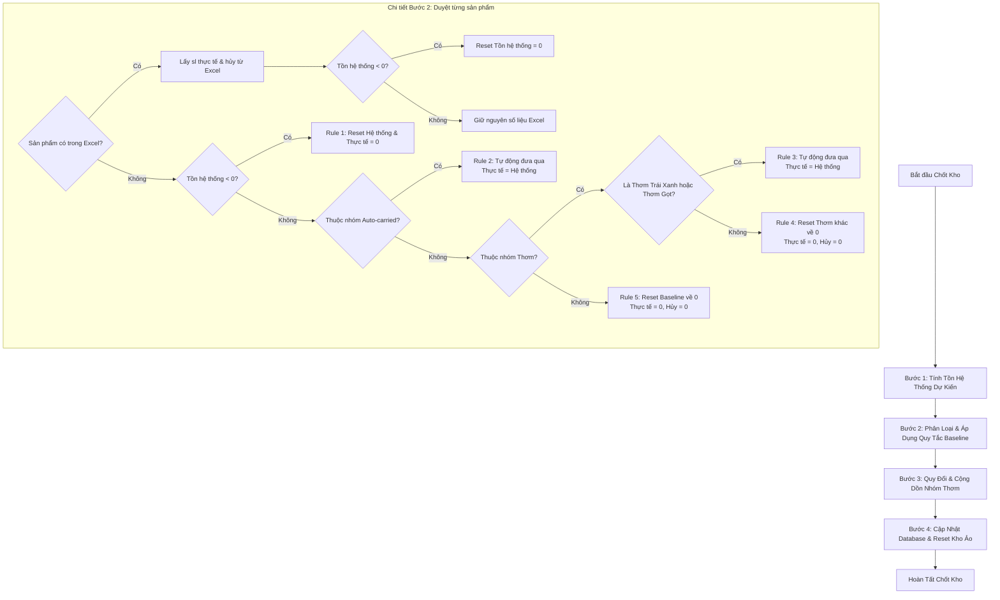

# QUY TRÌNH CHỐT BASELINE & THỨ TỰ ÁP DỤNG QUY TẮC ĐỐI SOÁT
## Kho Rau Sạch Trần Gia

Tài liệu này tổng hợp chi tiết cơ chế chốt baseline tồn kho, phân nhóm sản phẩm, các quy tắc đối soát số liệu và quan trọng nhất là **thứ tự áp dụng (Order of Execution)** của các quy tắc này trong hệ thống thực tế.

---

## 1. Phân Nhóm Sản Phẩm Đối Soát

Trước khi áp dụng các quy tắc, hệ thống thực hiện phân loại toàn bộ danh mục sản phẩm thành các nhóm đặc thù dựa trên tên và mã sản phẩm (`masp`):

### 1.1. Nhóm Tự Động Chuyển Qua (Auto-carried)
Là những sản phẩm có tính chất lưu kho lâu hơn hoặc không bắt buộc phải kiểm kê hàng ngày. Nếu không xuất hiện trong file Excel kiểm kho thực tế, tồn kho của chúng vẫn được giữ nguyên từ số liệu hệ thống (nếu không bị âm).
*   **Điều kiện nhận diện (tên sản phẩm chứa các từ khóa):**
    *   `dưa hấu`
    *   `bắp` (loại trừ các tên chứa: `cải`, `chuối`, `đậu`, `thịt` để tránh nhầm với bắp cải, bắp bò...)
    *   `cải chua`
    *   `hành tây`

### 1.2. Nhóm Đặc Thù "Thơm" (Pineapple)
Nhóm sản phẩm làm từ thơm yêu cầu gom số liệu tồn kho về một mã sản phẩm gốc duy nhất để quản lý tập trung.
*   **Điều kiện nhận diện:** Tên sản phẩm chứa từ khóa `thơm` (loại trừ `rau thơm`).
*   **Phân loại chi tiết bên trong nhóm:**
    *   **Thơm trái xanh (Sản phẩm gốc):** Mã sản phẩm chính xác là `I100220` (đơn vị: Trái). Đây là sản phẩm nhận quy đổi cộng dồn từ các sản phẩm thơm khác.
    *   **Thơm gọt (Độc lập):** Tên sản phẩm chứa từ khóa `gọt` (ví dụ: Thơm gọt kg, Thơm gọt trái). Nhóm này **loại trừ hoàn toàn** khỏi quy tắc quy đổi (giữ nguyên số liệu thực tế độc lập).
    *   **Các loại thơm khác (Bị reset & quy đổi):** Ví dụ như Thơm xanh kg (`I101127`), Thơm chín, Thơm trái hườm, Thơm băm, Thơm lát... Nhóm này sẽ bị reset tồn kho về 0 tại dòng của chúng và quy đổi số lượng cộng dồn vào **Thơm trái xanh**.

### 1.3. Nhóm Baseline Về 0 (Reset-to-zero)
*   Tất cả các sản phẩm còn lại không nằm trong danh sách tự động chuyển qua và không thuộc nhóm Thơm đặc biệt.
*   Nếu không xuất hiện trong file Excel kiểm kho thực tế, tồn thực tế chốt của chúng sẽ **tự động đưa về 0**.

---

## 2. Thứ Tự Áp Dụng Quy Tắc Đối Soát (Order of Application)

Quy trình chốt baseline tồn kho được thực hiện tuần tự qua **4 bước** nghiêm ngặt dưới đây:

### Bước 1: Tính toán tồn hệ thống dự kiến (Recalculate Expected System Stock)
Trước khi đối chiếu với kiểm kê thực tế, hệ thống phải xác định số lượng tồn kho lý thuyết dựa trên các giao dịch phát sinh từ thời điểm chốt kho gần nhất ($T_{prev}$) cho đến thời điểm chốt kho hiện tại ($T_{now}$):
$$\text{Tồn hệ thống dự kiến} = \text{Tồn thực tế chốt phiên trước} + \text{Tổng Nhập} - \text{Tổng Xuất}$$
*   **Tổng Nhập:** Lấy từ các đơn đặt hàng nhà cung cấp (`Dathangsanpham`) có trạng thái `danhan` (đã nhận) hoàn thành trong khoảng thời gian đối soát.
*   **Tổng Xuất:** Lấy từ các đơn giao khách hàng (`Donhangsanpham`) có trạng thái `dagiao`, `danhan` hoặc `hoanthanh` hoàn thành trong khoảng thời gian đối soát.

### Bước 2: Phân loại theo sự xuất hiện trong Excel & Áp dụng quy tắc Baseline
Hệ thống duyệt qua danh sách chốt kho của từng sản phẩm và áp dụng quy tắc theo thứ tự ưu tiên:

#### **Trường hợp A: Sản phẩm CÓ xuất hiện trong file Excel kiểm kho**
Luôn ưu tiên số liệu kiểm kho vật lý thực tế của thủ kho:
1.  Cập nhật số tồn thực tế (`sltonthucte`) và số lượng hủy (`slhuy`) theo đúng số liệu trong file Excel.
2.  **Quy tắc reset hệ thống âm:** Kiểm tra nếu tồn hệ thống dự kiến của sản phẩm bị âm (`sltonhethong < 0`), hệ thống tự động đưa `sltonhethong = 0` để tránh lỗi âm lũy kế âm ảo.
    *   *Ghi chú DB:* `Cập nhật từ Excel (Tồn hệ thống âm tự động reset về 0)`.

#### **Trường hợp B: Sản phẩm KHÔNG CÓ trong file Excel kiểm kho**
Áp dụng các quy tắc tự động theo thứ tự ưu tiên giảm dần:
1.  **Quy tắc 1 (Triệt tiêu kho âm - Ưu tiên hàng đầu):** Nếu tồn hệ thống dự kiến bị âm (`sltonhethong < 0`), hệ thống tự động reset toàn bộ số liệu về 0:
    *   Đặt: `sltonhethong = 0`, `sltonthucte = 0`, `slhuy = 0`.
    *   *Ghi chú DB:* `Tự động reset kho âm về 0 (Rules.md)`.
2.  **Quy tắc 2 (Nhóm Tự Động Chuyển Qua):** Nếu tồn hệ thống dự kiến $\ge 0$ và thuộc danh sách sản phẩm Auto-carried (Dưa hấu, Bắp, Cải chua, Hành tây):
    *   Giữ nguyên tồn hệ thống dự kiến.
    *   Gán tồn thực tế bằng tồn hệ thống: `sltonthucte = sltonhethong`.
    *   *Ghi chú DB:* `Tự động đưa qua (không có trong Excel - Auto-carried)`.
3.  **Quy tắc 3 (Nhóm Thơm gốc và Thơm gọt):** Nếu tồn hệ thống dự kiến $\ge 0$ và sản phẩm là Thơm Trái Xanh (`I100220`) hoặc Thơm Gọt (tên chứa từ `gọt`):
    *   Giữ nguyên tồn hệ thống dự kiến.
    *   Gán tồn thực tế bằng tồn hệ thống: `sltonthucte = sltonhethong`.
    *   *Ghi chú DB:* `Tự động đưa qua (Thơm trái xanh/Thơm gọt - Auto-carried)`.
4.  **Quy tắc 4 (Nhóm Thơm khác):** Nếu tồn hệ thống dự kiến $\ge 0$ và là sản phẩm Thơm khác (ngoài Thơm Trái Xanh và Thơm Gọt):
    *   Reset tồn thực tế và số lượng hủy về 0: `sltonthucte = 0`, `slhuy = 0`.
    *   *Ghi chú DB:* `Thơm khác reset về 0 (không có trong Excel - Rules.md)`.
5.  **Quy tắc 5 (Nhóm Baseline về 0 - Các sản phẩm còn lại):** Nếu không khớp các quy tắc trên:
    *   Reset tồn thực tế và số lượng hủy về 0: `sltonthucte = 0`, `slhuy = 0`.
    *   *Ghi chú DB:* `Reset về 0 (không có trong Excel - Rules.md)`.

### Bước 3: Quy đổi và Cộng dồn nhóm Thơm (Pineapple Inventory Consolidation)
Sau khi hoàn tất phân loại toàn bộ danh sách ở Bước 2, hệ thống thực hiện gom số liệu từ các sản phẩm Thơm khác về sản phẩm gốc **Thơm trái xanh (`I100220`)** theo cơ chế sau:

1.  **Tìm sản phẩm gốc:** Định vị bản ghi của Thơm Trái Xanh (`I100220`) trong danh sách đã xử lý ở Bước 2.
2.  **Gom tồn kho lũy kế:** Duyệt qua tất cả các sản phẩm thuộc nhóm Thơm khác (loại trừ sản phẩm Thơm gọt):
    *   Tính tổng số lượng thực tế, hệ thống và hủy của các sản phẩm này.
    *   Quy đổi theo tỷ lệ **1 trái tương đương 1 kg** (cộng trực tiếp giá trị số lượng vào sản phẩm gốc Thơm Trái Xanh):
        *   `sltonthucte (Thơm trái xanh) += sltonthucte (Thơm khác)`
        *   `sltonhethong (Thơm trái xanh) += sltonhethong (Thơm khác)`
        *   `slhuy (Thơm trái xanh) += slhuy (Thơm khác)`
3.  **Reset các sản phẩm phụ:** Toàn bộ tồn kho thực tế, hệ thống và số lượng hủy của các sản phẩm Thơm khác sau khi quy đổi sẽ được đưa về 0 (`sltonhethong = 0`, `sltonthucte = 0`, `slhuy = 0`).
4.  **Ghi chú đối soát:**
    *   *Tại sản phẩm Thơm khác:* `Quy đổi tồn kho về Thơm trái xanh [I100220] (Rules.md)`.
    *   *Tại sản phẩm gốc Thơm trái xanh:* Bổ sung nội dung ghi chú: `... (Nhận quy đổi từ các loại thơm khác: +X thực tế, +Y hệ thống, +Z hủy)`.

### Bước 4: Cập nhật Cơ sở dữ liệu (Database Updates)
Hệ thống tiến hành lưu trữ các số liệu đã đối soát vào cơ sở dữ liệu một cách tuần tự để tránh tranh chấp dữ liệu (deadlock):

1.  **Cập nhật `Chotkhodetail`:** Cập nhật các trường `sltonhethong`, `sltonthucte`, `slhuy`, `ghichu` và tính toán chênh lệch thực tế:
    $$\text{chenhlech} = \text{sltonhethong} - \text{sltonthucte} - \text{slhuy}$$
2.  **Cập nhật Kho vật lý (`SanphamKho`):** Cập nhật số lượng tồn kho vật lý tại Kho tổng (HCM - `KHO_TONG_ID`) bằng giá trị `sltonthucte` mới chốt.
3.  **Cập nhật Bảng tồn kho toàn cục (`TonKho`):** Ghi đè cả tồn khả dụng (`slton`) và tồn thực tế (`sltontt`) bằng giá trị `sltonthucte` vừa chốt.
4.  **Reset các kho ảo phụ:** Cập nhật số lượng của tất cả sản phẩm tại các kho phụ (khác `KHO_TONG_ID`) về 0 để gom toàn bộ tồn kho vật lý về Kho tổng.

---

## 3. Quy Tắc Kế Toán Sửa Số Liệu & Điều Chỉnh Ngày Cũ

Để tránh làm hỏng cấu trúc baseline lũy kế đã được chốt tự động ở trên, kế toán và thủ kho phải tuân thủ nghiêm ngặt các nguyên tắc sau:

### 3.1. Nguyên tắc khóa sổ (No Retrospective Edits)
*   Sau khi phiên chốt kho của ngày $T$ hoàn tất, **tuyệt đối không được quay lại sửa đổi** các thông tin liên quan đến số lượng thực nhận (`slnhan`), thực giao (`slgiao`) hoặc trạng thái (`status`) của bất kỳ đơn hàng nào từ ngày $T$ trở về trước.
*   **Hậu quả:** Việc sửa ngược sẽ tạo ra lỗi "bóng ma" (Ghost Stock), làm mất tính khớp số 100% của các phiên chốt sau đó.

### 3.2. Cơ chế điều chỉnh sai lệch phát sinh
*   Nếu phát hiện sai sót số liệu của ngày cũ, không sửa trực tiếp đơn cũ. Kế toán phải **tạo Phiếu điều chỉnh tồn kho vật lý (Inventory Adjustment)** vào **phiên làm việc của ngày hôm nay** ($T+1$).
*   Phiếu điều chỉnh phải ghi rõ mã sản phẩm, số lượng điều chỉnh (+/-) và lý do chi tiết để phục vụ Audit Trail (ghi vết lịch sử).

### 3.3. Xử lý đơn hàng treo quá hạn (Overdue Order Cleanup)
*   **Tần suất rà soát:** Hàng tuần.
*   **Hành động:** 
    *   Hủy (`huy`) các đơn đặt hàng hoặc đơn khách hàng có ngày giao/nhận quá hạn > 7 ngày và không còn giao dịch thực tế.
    *   Chuyển trạng thái sang hoàn thành (`hoanthanh` / `danhan`) nếu đơn hàng đã giao dịch thực tế nhưng chưa được cập nhật trên app.
*   **Mục đích:** Ngăn hệ thống tính lũy kế nhu cầu ảo, dẫn đến gợi ý mua hàng sai lệch.

### 3.4. Công thức hao hụt tài chính
$$\text{Giá trị hao hụt tài chính} = (\text{Tồn hệ thống} - \text{Tồn thực tế} - \text{Hao hụt/Hủy báo cáo}) \times \text{Giá gốc snapshot}$$
*   **Đối soát công nợ:** Đối chiếu số lượng thực tế giao từ Kho (`slgiao`) với số lượng khách thực nhận chốt (`slnhan`) để khấu trừ công nợ chính xác, tránh lệch tiền do khách trả hàng hoặc giao thiếu.
