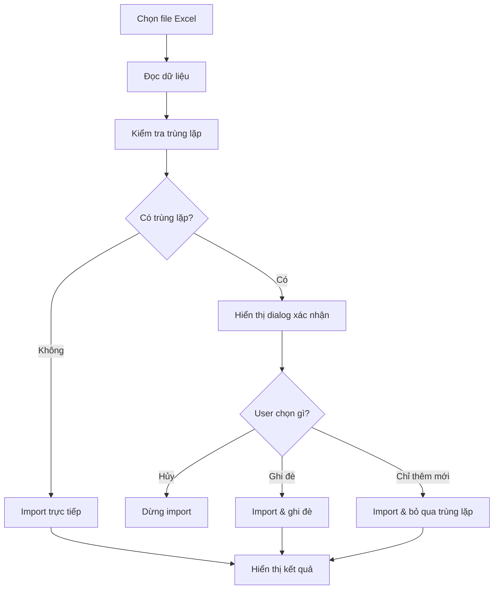

# 📋 Tóm tắt cập nhật Import Data với xác nhận ghi đè

## ✨ Tính năng mới
Đã cập nhật chức năng import data để **hỏi xác nhận người dùng** khi phát hiện dữ liệu trùng lặp, giúp tránh việc ghi đè dữ liệu quan trọng một cách không mong muốn.

## 🎯 Vấn đề giải quyết
**Trước đây:** Import data sẽ tự động ghi đè tất cả dữ liệu mà không hỏi người dùng → **Rủi ro mất dữ liệu cao**

**Bây giờ:** Hệ thống sẽ:
1. ✅ Kiểm tra trùng lặp tự động
2. ✅ Hiển thị dialog xác nhận với thông tin chi tiết
3. ✅ Cho phép người dùng lựa chọn: **Ghi đè** hoặc **Chỉ thêm mới**
4. ✅ Hiển thị feedback rõ ràng về kết quả

## 🔧 Files được tạo/cập nhật

### 1. Dialog Component (MỚI)
```
/frontend/src/app/admin/importdata/import-confirmation-dialog.component.ts
```
- Component dialog hiển thị xác nhận import
- Hiển thị danh sách trùng lặp và tùy chọn ghi đè

### 2. Main Import Component (CẬP NHẬT)
```
/frontend/src/app/admin/importdata/listimportdata/listimportdata.component.ts
```
- Thêm `ImportDataValidationService` cho logic kiểm tra trùng lặp
- Thêm method `showImportConfirmDialog()` 
- Cập nhật logic import cho: Sản phẩm, Khách hàng, Nhà cung cấp, Bảng giá

### 3. Documentation (MỚI)
```
/snippetcode/import-data-enhancement-guide.md
/snippetcode/demo-import-component.ts
/snippetcode/importdata-confirmation-dialog.ts
```

## 🚀 Cách sử dụng

### Scenario 1: Không có trùng lặp
```
✅ Không có dữ liệu trùng lặp. Tất cả sẽ được thêm mới.
[Hủy bỏ] [Import]
```

### Scenario 2: Có trùng lặp
```
⚠️ Phát hiện 3 mục trùng lặp:
• SP001 - Sản phẩm A  
• KH002 - Khách hàng B
• NCC001 - Nhà cung cấp X

☐ Ghi đè lên dữ liệu cũ (các mục trùng lặp sẽ được cập nhật)

ℹ️ Chỉ thêm mới các mục chưa tồn tại, bỏ qua các mục trùng lặp

[Hủy bỏ] [Import & Bỏ qua trùng lặp]
```

## 📊 Loại dữ liệu được hỗ trợ

| Loại dữ liệu | Trường kiểm tra | Trạng thái |
|--------------|-----------------|------------|
| 🛍️ Sản phẩm | `masp` | ✅ Hoàn thành |
| 👥 Khách hàng | `makh` | ✅ Hoàn thành |
| 🏢 Nhà cung cấp | `mancc` | ✅ Hoàn thành |
| 💰 Bảng giá | `mabanggia` | ✅ Hoàn thành |
| 📦 Đơn hàng | - | 🔄 Giữ nguyên |
| 📋 Đặt hàng | - | 🔄 Giữ nguyên |

## 💡 Lợi ích

### 👨‍💼 **Cho Business**
- **Giảm rủi ro mất dữ liệu** quan trọng
- **Tăng độ tin cậy** của hệ thống
- **UX chuyên nghiệp** như các phần mềm enterprise

### 👨‍💻 **Cho Developer**  
- **Code dễ maintain** với logic tập trung
- **Dễ mở rộng** cho các loại dữ liệu mới
- **Pattern nhất quán** cho tất cả import flow

### 👥 **Cho End User**
- **An tâm** khi import dữ liệu
- **Linh hoạt** trong việc xử lý trùng lặp
- **Thông tin rõ ràng** về những gì sẽ thay đổi

## 🔄 Workflow mới



## 🎯 Next Steps

1. **Test thực tế** với dữ liệu production
2. **Mở rộng** cho Đơn hàng, Đặt hàng nếu cần
3. **Thêm tính năng** backup trước khi ghi đè
4. **Logging** chi tiết cho audit trail

---

**🏆 Kết quả:** Chức năng import data giờ đây **an toàn** và **chuyên nghiệp** hơn, giúp người dùng tự tin hơn khi làm việc với dữ liệu quan trọng.
